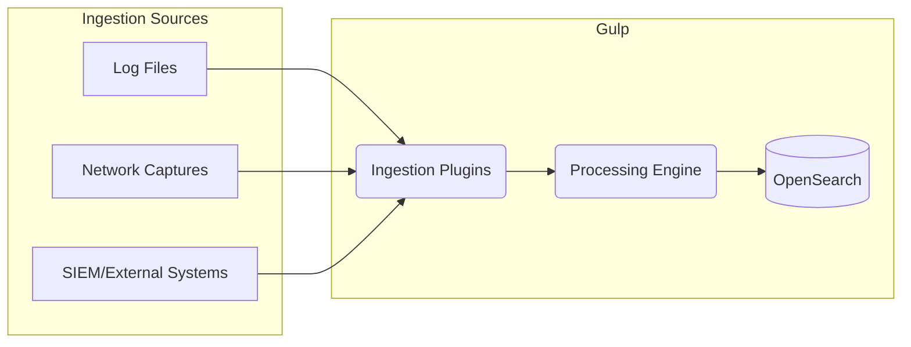
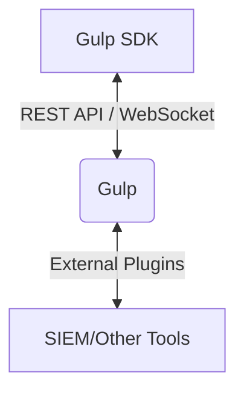

# Gulp Datasheet

## 1. Project Overview

Gulp is a powerful, scalable, and Python-based incident response and analysis platform. It is designed to ingest, process, and analyze large volumes of data from various sources in near real-time. Gulp facilitates collaborative investigations by providing a unified interface for data exploration, enrichment, and annotation. Its high-speed multiprocessing engine and flexible plugin architecture make it an adaptable solution for security operations centers (SOCs), incident response teams, and digital forensics investigators.

**Main Use Cases:**

* Centralized log aggregation and analysis.
* Collaborative incident response and digital forensics (**WIP**)
* Security event correlation and threat hunting.
* Extensible data processing and enrichment pipelines.

## 2. Core Features

### Data Ingestion and Plugins

Gulp's plugin-based architecture allows for flexible data ingestion from a multitude of sources.

* **Supported Formats:** Gulp can process a wide array of data formats through its ingestion plugins, including but not limited to JSON, CSV, Windows EVTX, PCAP, and various log formats.
* **Extensibility:** New data sources can be easily integrated by developing custom plugins. The plugin framework handles the underlying data processing, allowing developers to focus on parsing logic.

### OpenSearch/ECS Compatibility

Gulp leverages OpenSearch as its data store and utilizes the Elastic Common Schema (ECS) for data normalization.

* **OpenSearch Backend:** Provides a scalable and robust backend for storing and querying vast amounts of data.
* **ECS Standardization:** By mapping data to the ECS format, Gulp ensures consistency across different data sources, simplifying queries and analysis.

### Multiprocessing Engine

Gulp is built for performance, featuring a multiprocessing engine for high-speed ingestion and querying.

* **Parallel Processing:** Ingestion and query tasks are distributed across multiple processes, maximizing CPU utilization and throughput.
* **Scalability:** The engine's performance can be scaled vertically by adding more CPU cores.

### Sigma Rule Support

Gulp integrates support for Sigma rules, a generic and open signature format for security events.

* **Advanced Querying:** Analysts can leverage thousands of community-contributed Sigma rules to hunt for threats and suspicious activities.
* **Automated Detection:** Sigma rules can be run in parallel to automatically detect patterns of interest in the ingested data.

### Collaboration Platform

Gulp provides a rich collaboration environment for teams working on investigations.

* **Multi-User Support:** Multiple users can work within the same "operation," sharing access to data and findings.
* **Annotations:** Users can add notes, highlights, and links to documents, providing context and preserving investigative knowledge.
* **Shared Context:** All collaborative artifacts are stored in a central PostgreSQL database, ensuring that the entire team has a consistent view of the investigation.

### Web UI and REST API

Gulp offers both a web-based user interface and a comprehensive REST API.

* **Web UI:** The [Gulp Web UI](https://github.com/mentat-is/gulpui-web) provides an intuitive interface for data exploration, visualization, and collaboration. It features zoomable timelines for analyzing events across different contexts.
* **REST API:** A full-featured REST API exposes all of Gulp's capabilities, allowing for programmatic interaction and integration with other tools. The API is documented with Swagger/OpenAPI.

### Plugin Architecture

Gulp's functionality can be extended through various types of plugins:

* **Ingestion Plugins:** For parsing and ingesting data from different sources.
* **Enrichment Plugins:** To add context to existing data (e.g., WHOIS lookups, threat intelligence feeds).
* **External Plugins:** To query external systems like SIEMs and other security tools.
* **Extension Plugins:** To add new REST API endpoints and custom functionality.
* **UI Plugins:** To extend the Gulp Web UI.

## 3. Integration Capabilities

Gulp is designed for seamless integration into existing security ecosystems.

* **REST API:** The primary method for integration, allowing external applications to ingest data, run queries, and manage collaboration objects.
* **WebSocket Endpoints:** For real-time data streaming and notifications. Gulp uses WebSockets to push query results and status updates to clients.
* **External Plugins:** Allows Gulp to query and ingest data from external systems (i.e. SIEMS, other security tools)

> A [WIP Python SDK](https://github.com/mentat-is/gulp-sdk-python) is available to simplify interactions with the Gulp API.

## 4. Testing and Development

Gulp includes a comprehensive testing suite and clear guidelines for developers.

* **Test Suite:** The project provides a `test_suite.sh` script that covers the entire REST API, ingestion plugins, and query functionality. A `test_lite.sh` script is available for quicker, focused tests.
* **Developer Setup:** Detailed instructions are available for setting up a development environment, either manually or using the provided Docker container.
* **Plugin Development:** The documentation offers extensive guidance on developing new plugins, including the internal architecture and data flow.

## 5. Security and Access Control

Gulp includes features for securing the platform and controlling access to data.

* **Authentication:** User access is controlled via API tokens.
* **User and Group Management:** Gulp supports the creation of users and groups, with permissions managed at a granular level.
* **Permissions:** Permissions can be assigned to operations, contexts, and sources, ensuring that users can only access the data they are authorized to see.
* **HTTPS Support:** Gulp can be configured to enforce HTTPS and require client-side certificates for enhanced security.

## 6. Deployment

Gulp offers several deployment options to fit different environments.

* **Supported Platforms:** Gulp is primarily developed and tested on Linux, but it is reported to run on other unix-like platforms as well, like MacOS and Windows WSL (**although not recommended**).
* **Installation Methods:**
  * **Docker:** The recommended method for production deployment, using the provided `docker-compose.yml` file.
  * **Setup Script:** A `setup.sh` script is available for guided manual installation.
  * **Manual Installation:** Step-by-step instructions are provided for manual setup.
* **Configuration:** Gulp's behavior is controlled through a central `gulp_cfg.json` file, which allows for customization of database connections, OpenSearch endpoints, logging, and more.

## 7. Licensing

Gulp is released under a dual-license model.

* **AGPLv3:** The open-source version is licensed under the GNU Affero General Public License v3.0.
* **Commercial License:** A commercial license is available from Mentat Solutions s.r.l. for users who require different licensing terms.

## 8. References

* **GitHub Repository:** [https://github.com/mentat-is/gulp](https://github.com/mentat-is/gulp)
* **Architecture Documentation:** [docs/architecture.md](./docs/architecture.md)
* **Plugin Development:** [docs/plugins_and_mapping.md](./docs/plugins_and_mapping.md)
* **API Integration:** [docs/integration.md](./docs/integration.md)
* **Testing Guide:** [docs/testing.md](./gulp/docs/testing.md)
