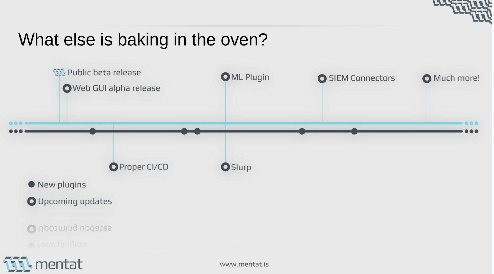

<div align="center">

<picture>
 <source media="(prefers-color-scheme: dark)" srcset="./image.png">
 <source media="(prefers-color-scheme: light)" srcset="./image.png">
 
</picture>

the generic, universal Log processor for incident response!

_made with :heart: by Mentat._

</div>

[](https://github.com/mentat-is?tab=followers)

<div align="center">

[Description](#Description) - [Architecture](#Architecture) - [API](#API) - [Installation](#Installation) - [Run & examples](#Run) - [GUI](#clients) - [Troubleshooting](./docs/Troubleshooting.md)

</div>

## Description

Gulp is a powerful software tool designed to streamline incident response and analysis. Its core features include:

### Current features

- **Data Ingestion Plugins**: Gulp can ingest data from a variety of sources, thanks to its versatile plugin system.
- **OpenSearch and ECS**: Gulp is built on OpenSearch and uses the *Elasticsearch Common Scheme (ECS)* as its ingestion format, ensuring compatibility and ease of use.
- **High-Speed Multiprocessing Engine**: Gulp's engine is designed for speed, offering fast ingestion and querying capabilities through multiprocessing.
- **Query using SIGMA rules**: Gulp supports querying using Sigma Rules, allowing for easy, one-click queries with thousands of rules in parallel.
- **Collaboration Platform**: Gulp includes a collaboration platform, enabling teams to work together on the same incident. Features include note-taking, highlighting, and link adding.
- **Innovative UI**: Gulp's user interface includes multiple on-screen per-context(i.e. a log source) zoomable timelines for visualizing events, making it easier to understand and analyze incidents.
- **Scalable**: Gulp is designed with scalability in mind. As your data and team grow, you can simply add more cores to increase parallel ingestion and query capabilities, and more OpenSearch and PostgreSQL hosts. This makes Gulp a flexible solution that can adapt to your evolving needs!
- **Python based**: Gulp is written in Python, leveraging open-source libraries whenever possible. This maximizes ease of adoption from the community, as Python is widely used and understood.
- **UI clients**: While [a full fledged web-ui](https://github.com/mentat-is/gulpui-web) is in the works, in the meantime you can use most of the features using the .NET client we use ourself to testdrive during development.

## Timeline

Here's the rough timeline we put together, it is subject to change:



soon we will release the slides we did at [MOCA2024](https://moca.camp), stay tuned!

## Installation
### Quick Install
```
curl https://raw.githubusercontent.com/mentat-is/gulp/refs/heads/develop/setup.sh | sudo bash
```
This will create a `gulp` folder, inside the current directory.

### Other installation methods
- [docker](<./docs/Install Docker.md>)
- [install from sources](<./docs/Install Dev.md>)

### Environment variables

the following environment variables may be set to override configuration options.

- `PATH_CONFIG`: if set, will be used as path for the configuration file (either, `~/.config/gulp/gulp_cfg.json` will be used)
- `PATH_PLUGINS`: if set, will be used as path for `plugins` directory (either, the default `$INSTALLDIR/plugins` will be used)
- `PATH_MAPPING_FILES`: if set, will be used as path for the mapping files to be used by plugins (either, the default is `$INSTALLDIR/mapping_files`)
- `PATH_CERTS`: if set, overrides `path_certs` in the configuration (for HTTPS).
- `ELASTIC_URL`: if set, overrides `elastic_url` in the configuration.
- `POSTGRES_URL`: if set, overrides `postgres_url` in the configuration.
- `SMTP_SERVER`: if set, overrides `smtp_server` in the configuration.
- `SMTP_USERNAME`: if set, overrides `stmp_username` in the configuration.
- `SMTP_PASSWORD`: if set, overrides `stmp_password` in the configuration.
- `SMTP_FROM`: if set, overrides `smtp_from` in the configuration.
- `GULP_INTEGRATION_TEST`: **TEST ONLY**, this must be set to 1 during integration testing (i.e. client api) to disable debug features which may interfere.

### SSL

to use HTTPS, the following certificates must be available:

> client certificates for `opensearch` and `postgresql` are used if found, `opensearch` key password is not supported.

- opensearch
  - `elastic_verify_certs: false` may be used to skip server verification
  - `$PATH_CERTS/opensearch-ca.pem`: path to the CA certificate for the Opensearch server
  - `$PATH_CERTS/opensearch.pem`: client certificate to connect to Opensearch server
  - `$PATH_CERTS/opensearch.key`: certificate key

- postgresql
  - `postgres_ssl: true` mut be set in the configuration
  - `postgres_verify_certs: false` may be used to skip server verification
  - `$PATH_CERTS/postgres-ca.pem`: path to the CA certificate for the PostgreSQL server
  - `$PATH_CERTS/postgres.pem` client certificate to connect to PostgreSQL server
  - `$PATH_CERTS/postgres.key`: certificate key

- gulp server
  - to connect gulp clients, use `https_enforce` to prevent HTTP connections, `https_enforce_client_certs` to enforce client certificates signed by `gulp-ca.pem`CA
  - `$PATH_CERTS/gulp-ca.pem`
  - `$PATH_CERTS/gulp.pem`
  - `$PATH_CERTS/gulp.key`

### Exposed services

- _http://localhost:8080_: gulp, swagger page [here](http://localhost:8080/docs)
- _localhost:5432_: postgres (**user/pwd: `postgres/Gulp1234!`**)
  - _http://localhost:8001_: adminer (**server/user/pwd: `postgres/postgres/Gulp1234!`**)
- _http://localhost:9200_: opensearch (**user/pwd: `admin/Gulp1234!`**)
  - _http://localhost:8082_: elasticvue
  - _http://localhost:5601_: opensearch dashboards (**user/pwd: `admin/Gulp1234!`**)

### Run

[with docker](<./docs/Install Docker.md#run>) or [with install from sources](<./docs/Install Dev.md#3-run>)

#### Test ingestion

```bash
# ingest single file
TEST_WS_ID="websocket_id" ./test_scripts/test_ingest.sh -p ./samples/win_evtx/Application_no_crc32.evtx

# ingest zip
TEST_WS_ID="websocket_id" ./test_scripts/test_ingest.sh -p ./test_scripts/test_upload_with_metadata_json.zip

# ingest with filter (GulpIngestFilter)
TEST_WS_ID="websocket_id" TEST_INGESTION_FILTER='{"level":[2]}' ./test_scripts/test_ingest.sh -p ./test_scripts/test_upload_with_metadata_json.zip -f

## multiple concurrent ingestion (using 2 target websockets)
TEST_WS_ID="websocket_id1" TEST_TOKEN=80d5ed1e-c30f-4926-872d-92bcc5a2235d ./test_scripts/test_ingest.sh -p ./samples/win_evtx && TEST_WS_ID="websocket_id2" TEST_TOKEN=80d5ed1e-c30f-4926-872d-92bcc5a2235d TEST_CONTEXT=context2 TEST_OPERATION=testop2 ./test_scripts/test_ingest.sh -p ./samples/win_evtx

# ingest with csv plugin without mapping file ("@timestamp" in the document is mandatory, so in one way or another we must know at least how to obtain a timestamp for ingested event)
TEST_WS_ID="websocket_id" TEST_PLUGIN_PARAMS='{"timestamp_field": "UpdateTimestamp"}' TEST_PLUGIN=gi_csv ./test_scripts/test_ingest.sh -p ./samples/mftecmd/sample_j.csv

# ingest with csv plugin with mapping file
TEST_WS_ID="websocket_id" TEST_PLUGIN_PARAMS='{"mapping_file": "mftecmd_csv.json", "mapping_id": "j"}' TEST_PLUGIN=gi_csv ./test_scripts/test_ingest.sh -p ./samples/mftecmd/sample_j.csv

# example overriding a configuration parameter (will stay overridden until gulp restarts)
TEST_WS_ID="websocket_id" TEST_PLUGIN_PARAMS='{"mapping_file": "mftecmd_csv.json", "mapping_id": "j", "config_override": { "debug_allow_any_token_as_admin": true }' TEST_PLUGIN=gi_csv ./test_scripts/test_ingest.sh -p ./samples/mftecmd/sample_j.csv

# ingest local directory (just for testing, not available in production code and not available when gulp runs in docker)
TEST_WS_ID="websocket_id" ./test_scripts/test_ingest.sh -x -p ./samples/win_evtx

# sample ingestion with filter
TEST_INGESTION_FILTER='{"start_msec":1475719436055, "end_msec": 1475719436211}' TEST_WS_ID=abc ./test_scripts/test_ingest.sh -p ./samples/win_evtx -f

# same as above, send filtered chunks on websocket but store data anyway on database (do not apply filter on-store)
TEST_INGESTION_FILTER='{"start_msec":1475719436055, "end_msec": 1475719436211, "store_all_documents": true}' TEST_WS_ID=abc ./test_scripts/test_ingest.sh -p ./samples/win_evtx -f
```

> - for testing websocket, a browser extension i.e. [chrome websockets browser extension](https://chromewebstore.google.com/detail/browser-websocket-client/mdmlhchldhfnfnkfmljgeinlffmdgkjo) may be used.
>
>   - if TEST_WS_ID is not specified, ingestion happens anyway, but results are not broadcasted.
>
> - resuming ingestion is supported **if the `req_id` parameter is the same across requests**.

## Architecture

[GULP architecture](./docs/Architecture.md)

## Clients

### Web Client

If you want to use the web GUI visit it's repository [here](https://github.com/mentat-is/gulpui-web).
It's still heavily under construction, so any contribution is highly appreciated!

This is the intended official wanna-be client for gulp.

### .NET Client

> [!IMPORTANT] ⚠ the .NET client is to be considered an internal-test version, this is the tool we use internally to testdrive the backend development.
> It is not feature complete and far from being production ready :).
> Feel free to open issues, but any contribution should go towards the new WIP [web client](https://github.com/mentat-is/gulpui-web)

If you want to use the .NET client "as-is", you can use the Windows binary from [here](https://github.com/mentat-is/gulp/bins/gulp-dotnet.zip).
To run the executable on Linux, install .NET 6.0 using `wine` and run `GUiLP.exe`.
