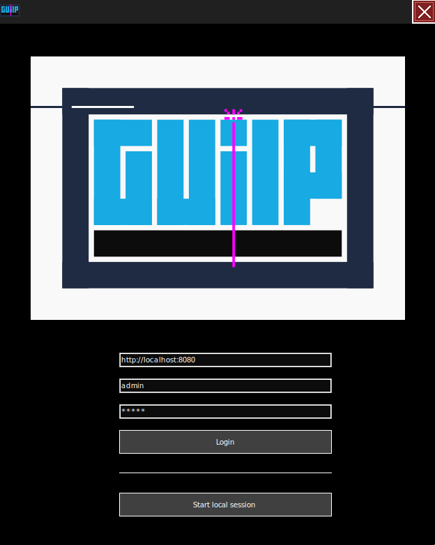
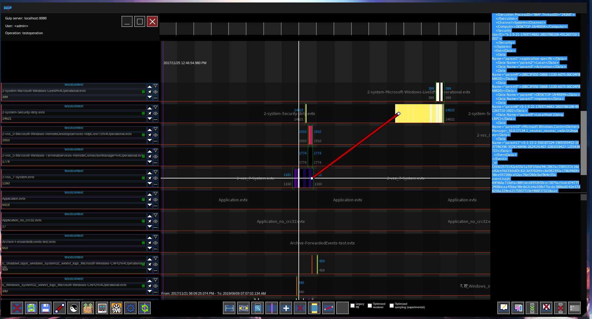

<picture>
 <source media="(prefers-color-scheme: dark)" srcset="./image.png">
 <source media="(prefers-color-scheme: light)" srcset="./image.png">
 
</picture>

the generic, universal Log processor for incident response!

_made with :heart: by Mentat._

[Description](#description) - [Architecture](#architecture) - [Installation](#installation) - [Run & examples](#run) - [GUI](#clients) - [Troubleshooting](./docs/Troubleshooting.md)

## Description

Gulp is a powerful software tool designed to streamline incident response and analysis. Its core features include:

### Current features

- **Data Ingestion Plugins**: Gulp can ingest data from a variety of sources, thanks to its versatile plugin system.
- **OpenSearch and ECS**: Gulp is built on OpenSearch and uses the _Elasticsearch Common Scheme (ECS)_ as its ingestion format, ensuring compatibility and ease of use.
- **High-Speed Multiprocessing Engine**: Gulp's engine is designed for speed, offering fast ingestion and querying capabilities through multiprocessing.
- **Query using SIGMA rules**: Gulp supports querying using Sigma Rules, allowing for easy, one-click queries with thousands of rules in parallel.
- **Collaboration Platform**: Gulp includes a collaboration platform, enabling teams to work together on the same incident. Features include note-taking, highlighting, and link adding.
- **Innovative UI**: Gulp's user interface includes multiple on-screen per-context(i.e. a log source) zoomable timelines for visualizing events, making it easier to understand and analyze incidents.
- **Scalable**: Gulp is designed with scalability in mind. As your data and team grow, you can simply add more cores to increase parallel ingestion and query capabilities, and more OpenSearch and PostgreSQL hosts. This makes Gulp a flexible solution that can adapt to your evolving needs!
- **Python based**: Gulp is written in Python, leveraging open-source libraries whenever possible. This maximizes ease of adoption from the community, as Python is widely used and understood.
- **UI clients**: While [a full fledged web-ui](https://github.com/mentat-is/gulpui-web) is in the works, in the meantime you can use most of the features using the .NET client we use ourself to testdrive during development.

## Timeline

Here's the rough timeline we put together, it is subject to change:

## Moca 2024 presentation

[here is our presentation](https://docs.google.com/presentation/d/e/2PACX-1vTynDHQqr2hN6d3Mlq7UGADR-SAePDUD_M9CdPd2VrS5n11JkrrWMj00KQb9flhG8i2VUlKOn2tr5Ny/pub?start=false&loop=false&delayms=3000) at [MOCA2024](https://moca.camp).

## Installation

### TLDR ;)

| :warning: WARNING                                                                          |
| :----------------------------------------------------------------------------------------- |
| [READ THIS TO INSTALL until we have a fix :)](https://github.com/mentat-is/gulp/issues/37) |

<del>
#### docker
this will start the provided [docker-compose.yml](./docker-compose.yml) in the current directory and uses [gulp_cfg_template.json](./gulp_cfg_template.json) and [default .env](./.env) as base.
~~~bash
curl https://raw.githubusercontent.com/mentat-is/gulp/refs/heads/develop/bootstrap.sh -o ./bootstrap.sh && chmod 755 ./bootstrap.sh && ./bootstrap.sh
~~~
#### from source
this will install from sources and create a `gulp` folder, inside the current directory.
~~~bash
curl https://raw.githubusercontent.com/mentat-is/gulp/refs/heads/develop/setup.sh | sudo bash
~~~
</del>

### Exposed services

> using the default configuration

- [gulp swagger page on http://localhost:8080/docs](http://localhost:8080/docs)
- [gulp web UI on http://localhost:3000](http://localhost:3000)
  - **user/pwd: `admin/admin`** (default gulp admin user)
- postgreSQL on **localhost:5432**
  - **user/pwd: `postgres/Gulp1234!`**
- [adminer on http://localhost:8001, to manage postgreSQL](http://localhost:8081)
  - **server/user/pwd: `postgres/postgres/Gulp1234!`**
- [opensearch on http://localhost:9200](http://localhost:9200)
  - **user/pwd: `admin/Gulp1234!`**
  - [elasticvue on http://localhost:8082](http://localhost:8082)

### Installation details

- [docker](<./docs/Install Docker.md>)
- [install from sources](<./docs/Install Dev.md>)
- [installing extra plugins](<./docs/Install Dev.md/#-installing-extra-plugins>)

### Environment variables

the following environment variables may be set to override configuration options.

- `BIND_TO`: if set, gulp will listen to this interface and port (either, the default `0.0.0.0:8080` is used)
- `PATH_CONFIG`: if set, will be used as path for the configuration file (either, `~/.config/gulp/gulp_cfg.json` will be used)
- `PATH_PLUGINS`: if set, will be used as path for `plugins` directory (either, the default `$INSTALLDIR/plugins` will be used)
- `PATH_MAPPING_FILES`: if set, will be used as path for the mapping files to be used by plugins (either, the default is `$INSTALLDIR/mapping_files`)
- `PATH_INDEX_TEMPLATE`: if set, will be used as the path for the index template to be used when creating new indexes (either, [default](./src/gulp/api/mapping/index_template/template.json) is used)
- `PATH_CERTS`: if set, overrides `path_certs` in the configuration (for HTTPS).
- `OPENSEARCH_URL`: if set, overrides `opensearch_url` in the configuration.
- `POSTGRES_URL`: if set, overrides `postgres_url` in the configuration.
- `GULP_INTEGRATION_TEST`: **TEST ONLY**, this must be set to 1 during integration testing (i.e. client api) to disable debug features which may interfere.

### SSL

to use HTTPS, the following certificates must be available:

> client certificates for `opensearch` and `postgresql` are used if found, `opensearch` key password is not supported.

- opensearch
  - `opensearch_verify_certs: false` may be used to skip server verification
  - `$PATH_CERTS/opensearch-ca.pem`: path to the CA certificate for the Opensearch server
  - `$PATH_CERTS/opensearch.pem`: client certificate to connect to Opensearch server
  - `$PATH_CERTS/opensearch.key`: certificate key

- postgresql
  - `postgres_ssl: true` mut be set in the configuration
  - `postgres_verify_certs: false` may be used to skip server verification
  - `$PATH_CERTS/postgres-ca.pem`: path to the CA certificate for the PostgreSQL server
  - `$PATH_CERTS/postgres.pem` client certificate to connect to PostgreSQL server
  - `$PATH_CERTS/postgres.key`: certificate key

- gulp server
  - to connect gulp clients, use `https_enforce` to prevent HTTP connections, `https_enforce_client_certs` to enforce client certificates signed by `gulp-ca.pem`CA
  - `$PATH_CERTS/gulp-ca.pem`
  - `$PATH_CERTS/gulp.pem`
  - `$PATH_CERTS/gulp.key`

### Run

[with docker](<./docs/Install Docker.md#run-with-docker-compose>) or [with install from sources](<./docs/Install Dev.md#7-run>)

> currently, we recommend to install from sources!
>
#### Test

[testing docs](./docs/Testing%20Plugins.md)

## Architecture

[GULP architecture](./docs/Architecture.md)

## Clients

### Web UI

get it [here](https://github.com/mentat-is/gulpui-web) !

### .NET Client

deprecated, use [the web UI](https://github.com/mentat-is/gulpui-web) !

<del>
> [!IMPORTANT] ⚠ the .NET client is to be considered an internal-test version, this is the tool we use internally to testdrive the backend development.
> It is not feature complete and far from being production ready :).
> Feel free to open issues, but any contribution should go towards the new WIP [web client](https://github.com/mentat-is/gulpui-web)

If you want to use the .NET client "as-is", you can use the Windows binary from [here](https://github.com/mentat-is/gulp/releases/download/legacy/GUiLP_legacy_bin.7z).

To run the executable on Linux, follow these steps:

1. start gulp backend with

~~~bash
# add --reset-collab --reset-index indexname if reset/initialization is needed
BIND_TO=0.0.0.0:8080 gulp
~~~

2. start the UI

  on `arch linux (endeavouros)`, other OS should be similar (just package names changes, if any)

  ~~~bash
  paru -S wine wine-mono winetricks
  winetricks -q dotnetdesktop6
  chmod 755 ./GUiLP.exe
  ./GUiLP.exe
  ~~~

3. make sure the ui points to `http://localhost:8080`

4. profit!

- legacy UI documentation (should be enough to get you up and running)

  [.NET UI documentation](https://docs.google.com/document/d/e/2PACX-1vT2BwplEQeXmlSScGkmQkQ2TLTQlRLwxMDaaV1npdUB78pKJ12AJXFzFsP9oWpqBtiH9L4s_B1FPm9w/pub)

- usage demo

  
</del>
