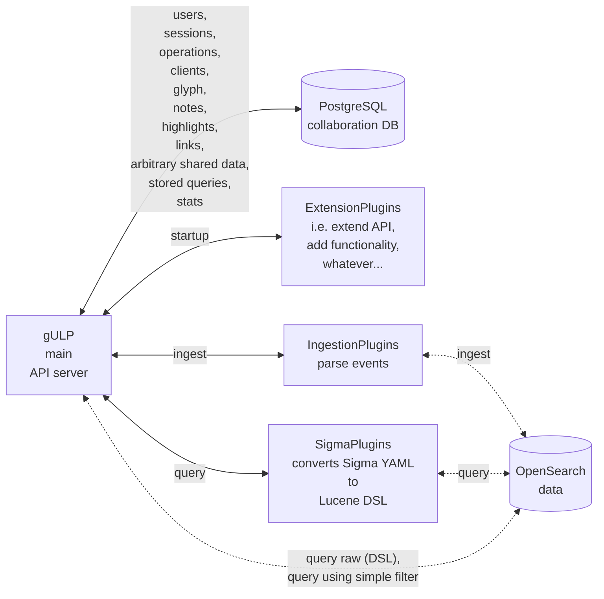
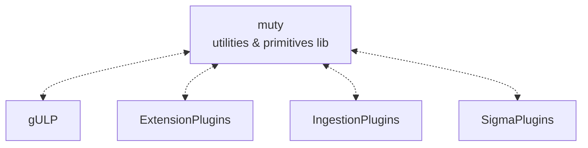
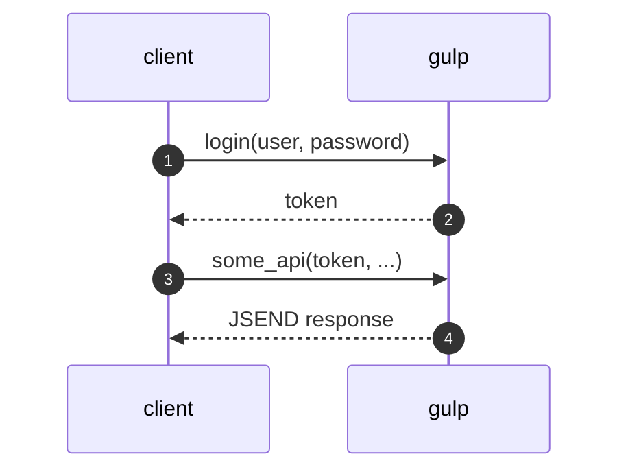
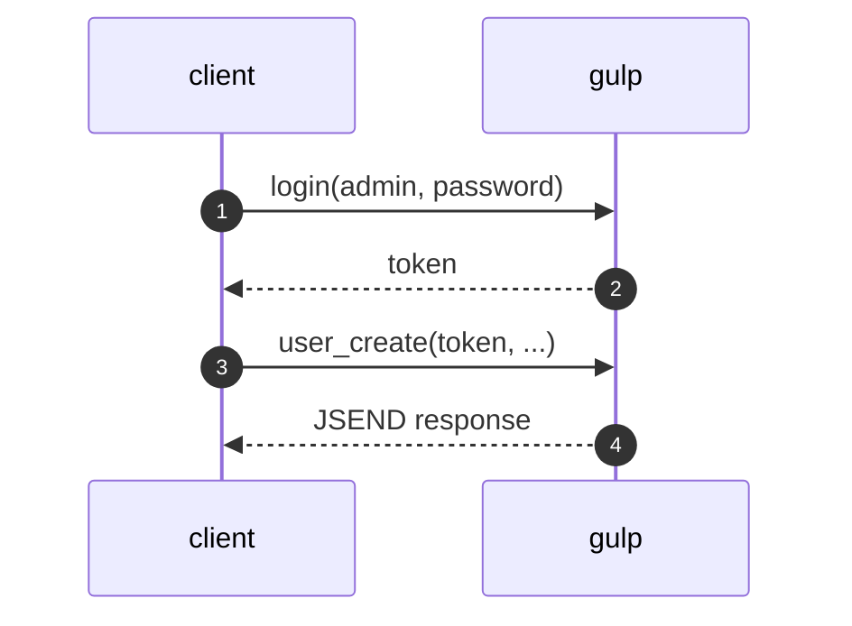
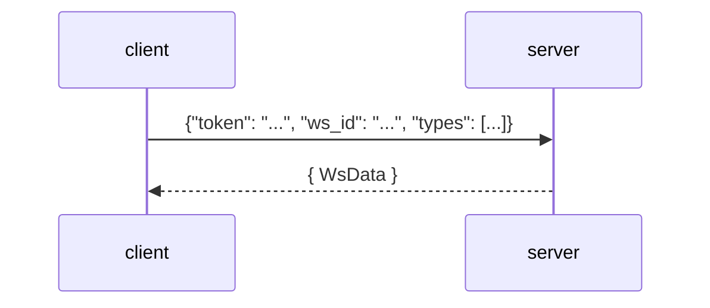

[TOC]
# Introduction
In the following document there's a high level overview of GULP's architecture.

## GULP architecture
TLDR :)



All components are based on the [muty utility library](https://github.com/mentat-is/muty-python)



### Plugins

all plugins conforms to the [PluginBase](https://github.com/mentat-is/gulp/src/gulp/plugin.py) class.

> [doxygen](https://github.com/mentat-is/gulp/Doxyfile) documentation may be generated in the `./docs` directory, to ease browsing of plugin-related source code.
> To generate simply run `git submodule update --init --recursive && doxygen` from inside the root of the cloned repository

- _ingestion plugins_ ingests events from different sources, i.e. _windows evtx, apache CLF_, ... creating documents on OpenSearch.

  - **they must reside in `$PLUGINDIR/ingestion`**.
  - documents are created mapping each event field to the [ECS standard](https://www.elastic.c/guide/en/ecs/current/index.html) as close as possible, resulting in ECS-compliant data stored in the OpenSearch index.
  > ingestion plugins may be stacked in a chain, as in the [chrome_history_sqlite_stacked](https://github.com/mentat-is/gulp/src/gulp/plugins/ingestion/chrome_history_sqlite_stacked.py) plugin.


- _sigma plugins_ leverages [pysigma pipelines](https://sigmahq-pysigma.readthedocs.io/en/latest/index.html) to convert
  [sigma rules](https://github.com/SigmaHQ/sigma) to [Lucene DSL queries](https://www.opensearch.co/guide/en/elasticsearch/reference/current/query-dsl-query-string-query.html) mapping the original rule fields to _ECS_.
  - **they must reside in `$PLUGINDIR/sigma`**.
  - to implement sigma plugins, look at the [windows sigma plugin](https://github.com/mentat-is/gulp/src/gulp/plugins/sigma/windows.py).

- _extension plugins_ are loaded at startup and may extend API and add functionality.
  - **they must reside in `$PLUGINDIR/extension`**.
  > look at the [extension_example](https://github.com/mentat-is/gulp/src/gulp/plugins/extension/extension_example.py) to see how they work (documentation inside).

- _query plugins_ are used by the `query_plugin` API to support querying external sources (i.e. *SIEM*, ...)
  - **they must reside in `$PLUGINDIR/query`**.

#### Mapping files

to customize mappings, plugins may use specifically crafted JSON files to be put in the [ecs](https://github.com/mentat-is/gulp/src/gulp/ecs) directory.

examples of such files and related API parameters may be found in the [ecs](https://github.com/mentat-is/gulp/src/gulp/ecs) folder and in [plugin_internal_py](https://github.com/mentat-is/gulp/src/gulp/plugin_internal.py).

for an extensive use of custom mapping, look at the
[csv plugin](https://github.com/mentat-is/gulp/src/gulp/plugins/ingestion/csv.py), which allows to ingest arbitrary CSV files with (*and also without*) mapping files.

### API

Once you start gulp, the api is available via the [openapi](http://localhost:8080/openapi.json) endpoint.

#### API flow



users must be created first with an ADMIN account



for ingestion, ingestion client must be created by admin user


#### Websocket

The endpoint `/ws` provides live feedback and results for _ingestion_, _queries_ and _collaboration objects_ via websocket:

`Make sure you pass a ws_id value as string`



Response from the websocket is a [WsData](./src/gulp/api/rest/ws.py) object like the following:

```json
{
  // type can be one of the defined WsQueueDataType in gulp/api/rest/ws.py
  // it will be checked agains websocket parameter "types", to send to the websocket only the types it is interested in (empty "types"=send all)
  "type": 2,
  // data contains the object (GulpStats or CollabObject) itself
  "data": {
    "type": 5,
    "req_id": "099ff6b6-65fb-41aa-821f-d7fc9bd612c1",
    "operation_id": 1,
    "client_id": 1,
    "context": "testcontext",
    "status": 0,
    "time_created": 1720705375978,
    "time_expire": 1720791775978,
    "time_update": 1720705447966,
    "time_end": 0,
    "ev_failed": 3,
    "ev_skipped": 1,
    "ev_processed": 66602,
    "files_processed": 23,
    "files_total": 24,
    "ingest_errors": {
      "/home/gulp/gulp/samples/win_evtx/sample_with_a_bad_chunk_magic.evtx": [
        "[/home/gulp/gulp/src/gulp/plugins/ingestion/win_evtx.py:ingest:349] IndexError: list index out of range\n"
      ],
      "/home/gulp/gulp/samples/win_evtx/sysmon.evtx": [
        "[/home/gulp/gulp/src/gulp/plugins/ingestion/win_evtx.py:ingest:337] RuntimeError: Failed to parse chunk header\n"
      ],
      "/home/gulp/gulp/samples/win_evtx/security.evtx": [
        "[/home/gulp/gulp/src/gulp/plugins/ingestion/win_evtx.py:record_to_gulp_document:138]   File \"<string>\", line 33\n[/home/gulp/gulp/src/gulp/plugins/ingestion/win_evtx.py:record_to_gulp_document:138] lxml.etree.XMLSyntaxError: PCDATA invalid Char value 3, line 33, column 33\n"
      ]
    },
    "current_src_file": "/home/gulp/gulp/samples/win_evtx/security_big_sample.evtx"
  },
  "req_id": "...",
  // the caller username, if available
  "username": null,
  "timestamp": 1720705447975,
  "ws_id": "def"
}
```
