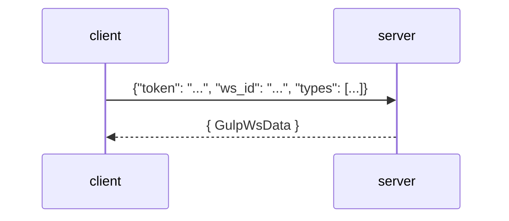

- [GULP architecture](#gulp-architecture)
- [API](#api)
  - [API flow](#api-flow)
  - [websocket](#websocket)

[TOC]

## GULP architecture

TLDR :)


All components are based on the [muty utility library](https://github.com/mentat-is/muty-python)


## API

Once you start gulp, the api is available via the [openapi](http://localhost:8080/openapi.json) endpoint.

### API flow


users must be created first with an ADMIN account


### websocket

The endpoint `/ws` provides live feedback and results for _ingestion_, _queries_ and _collaboration objects_ via websocket:

`Make sure you pass a ws_id value as string`



Response from the websocket is a [GulpWsData](../src/gulp/api/ws_api.py) object like the following:

> the `data` object in this case is a [GulpWsQueueDataType.STATS_UPDATE](../src/gulp/api/ws_api.py) containing a [GulpRequestStats](../src/gulp/api/collab/stats.py) object.

```json
{
  "@timestamp": 1735480177594,
  "type": "stats_update",
  "ws_id": "test_ws",
  "user_id": "ingest",
  "req_id": "test_req",
  "data": {
    "data": {
      "status": "ongoing",
      "time_expire": 1735566576328,
      "time_finished": 0,
      "source_processed": 0,
      "source_total": 1,
      "source_failed": 0,
      "records_failed": 0,
      "records_skipped": 0,
      "records_processed": 1000,
      "records_ingested": 1000,
      "id": "test_req",
      "type": "request_stats",
      "owner_user_id": "ingest",
      "granted_user_ids": [],
      "granted_user_group_ids": [],
      "time_created": 1735480176329,
      "time_updated": 1735480177589,
      "name": "test_req",
      "gulp.operation_id": "test_operation",
      "gulp.context_id": "66d98ed55d92b6b7382ffc77df70eda37a6efaa1"
    }
  }
}
```
