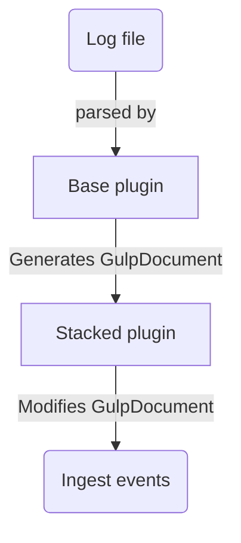

[TOC]

# Ingestion plugins

Gulp's architecture allows developers and users to add supported files for ingestion.

Gulp supports a bunch of different log formats for ingestion.
We currently support the following:

  - Apache's standard `access.log` and `error.log`
  - Windows `evtx`
  - Windows `registry` hives
  - Systemd `journal` files
  - A few of the Zimmerman tools' output files
  - A few Autopsy exports files
  - Chrome `history` and `webdata` db files
  - Network capture `pcap` and `pcapng` files
  - Email message boxes using `mbox` and plain `eml` files
  - Teamviewer's `connection_incoming.txt`
  - Generic `sqlite` databases
  - Generic single-line text files via the `regex` plugin
  - Generic `csv` files

Along side the specific ones we also provide some generic "base" plugins which can be used as a base to build your own plugins!

Gulp dives ingestion plugins in 3 major categories:

  - mapping files
  - stacked plugins
  - python plugins

## Mapping files

While mapping files are not technically plugins, they serve a very similar purpose, with some limitations.
A mapping file basically instructs an existing plugins how to parse the various fields from the log, using a simplified `json` stucture.

While making mappings, try to adhere to one of the following conventions (ordered from most to least preferred):
  1. `ECS` standard defined by elastic [here](https://www.elastic.co/guide/en/ecs/current/index.html)
  2. `gulp.<meaningful_name>.*` such as `gulp.http.query.params.<name>` or `gulp.pcap.<protocol>.field`
  3. anything else

Remember, the more standardized the logs we collect are, the easier it will be to create and share detection rules and query snippets!

Mapping files are extremely useful when using a base plugin such as the `csv`, `sqlite` or `regex` plugins.

Here's a minimal example taken from the `RecentFileCacheParser_csv.json` file under `src/gulp/mapping_files` folder, where mappings are typically placed.

```json
{
  "metadata": {
    "plugin": [
      "csv.py"
    ]
  },
  "mappings": [
    {
      "fields": {
        "SourceFile": {
          "map_to": "file.path"
        },
        "SourceCreated": {
          "is_timestamp": true,
          "event_code": "Created"
        },
        "SourceModified": {
          "is_timestamp": true,
          "event_code": "Modified"
        },
        "SourceAccessed": {
          "is_timestamp": true,
          "event_code": "Accessed"
        }
      },
      "options": {
        "event_code": "RecentFileCacheParser",
        "agent_type": "RecentFileCacheParser",
        "mapping_id": "recentfilecacheparser"
      }
    }
  ]
}
```

Let's break it down, starting from `metadata`.
This field contains useful information the server uses to categorize and suggest plugins to its clients.

In particular, `plugin` array lists all (*bare filenames of, i.e. name.py*) plugins which gulp should suggest this mapping for, in our case it's the `csv` plugin.

The next section is the `mappings` section, the core of the mapping file, this is a list of objects which are composed of 2 fields:

  - mapping : which contains the actual field-by-field mappings
  - options : options specific for each mapping (such as the `mapping_id`, `event_code`, `agent_type`)

Starting from the `mapping`, under this section we specify the fields and what to map them to.
In our example, the log contains the following fields, which we want to map to the following mappings:

  - **SourceFile**: indicates the name of the file
  - **SourceCreated**: this field in the log specifies when the file has been **created**
  - **SourceModified**: similarly this contains the last **modified** date of the file
  - **SourceModified**: finally, this contains the last **accessed** date of the file

Every mapping **must contain** at least one field specified as `is_timestamp` (or a `map_to` set to `@timestamp`), in order to allow indexing by the backing database.
The `is_timestamp` parameter implies `@timestamp`, moreover, when `is_timestamp` is set a new event is generated for each field indicated as timestamp.

Other options are described in more detail in the [mapping_fields](#mapping_fields) section.

At the end of the mapping field, the `options` field contains some, well, options for this specific mapping,
such as the value to fill the `event.code` field with, a `mapping_id`, etc.

### mapping fields

Each mapping field ([FieldMappingEntry](/docs/html/classmapping_1_1models_1_1_field_mapping_entry.html)) must contain the `map_to` field, additionally they can contain any of the following attributes:

| name    | description |
| -------- | ------- |
| map_to | the field name to map to on the database |
| is_timestamp | if true, gulp will attempt to parse the field as a timestamp and convert it automatically (default: false) |
| is_timestamp_chrome | if true, the timestamp will be treated as a webkit/chrome epoch (01/01/1601 00:00:00)|
| do_multiply | if value is numeric multiplies it by this value before saving it to te db (e.g. useful for converting ms to ns timestamps) |
| event_code | if set overrides the event code for the generated events |

> [!NOTE]
> If `map_to` is set to `@timestamp` the field will be mapped as timestamp and will be assumed to be in **milliseconds**.
> This is equivalent to setting `is_timestamp` to `True`, but without any parsing/conversion applied.

### options field

| name    | description |
| -------- | ------- |
| default_event_code | the default event code to apply to each event |
| agent_type | name of the plugin/mapping |
| mapping_id | a unique identifier, to identify a specific mapping in a file (in case multiple mappings are present) |

## Stacked plugins

Stacked plugins are python *ingestion* plugins which are base upon other plugins, usually generic plugins (such as `csv`, `sqlite`, etc),
but require a little more logic than a plain [mapping files](#mapping_files).

Instead of receiving a raw event from the log file, stacked plugins receive a `GulpDocument`,
which can be further modified before it gets ingested.

While you can **technically** stack as many plugins as you want, it is advised against for 3 main reasons:

  - readibility: quite self explanatory
  - performance: you go through more functions for each event in each file, this may impact performance depending on how performant each function is
  - KISS principle: if an event requires logic that is split into many different files to be parsed correctly, maybe it'd be better to write a [python plugin](#python_plugins) instead!

Let's get down to business!
A quite simple example of a stacked plugin is the [chrome_history_sqlite_stacked](https://github.com/mentat-is/gulp/src/gulp/plugins/ingestion/chrome_history_sqlite_stacked.py) plugin, which is based onto the [sqlite](https://github.com/mentat-is/gulp/src/gulp/plugins/ingestion/sqlite.py) generic plugin.

Since the logic behind acquiring data from an `sqlite` plugin is generic enough, it is a good foundation to build upon.
Here's a quick overview of how the data flows:



```python
async def ingest(
    self,
    index: str,
    req_id: str,
    client_id: int,
    operation_id: int,
    context: str,
    source: str | list[dict],
    ws_id: str,
    plugin_params: GulpPluginParams = None,
    flt: GulpIngestionFilter = None,
    **kwargs,
) -> GulpRequestStatus:

    #...
    try:
        mod = gulp_plugin.load_plugin("sqlite", self.collab, self.elastic, **kwargs)
        if plugin_params is None:
            plugin_params = GulpPluginParams()
    except Exception:
        Plugin.logger().exception("error!")
        return GulpRequestStatus.FAILED

    plugin_params.record_to_gulp_document_fun.append(self.record_to_gulp_document)
    plugin_params.mapping_file = "chrome_history.json"

    #...
```

Here the plugin loads the base plugin and appends it's own `record_to_gulp_document` function to be executed after the base plugin.
In this example, it also hardcodes a specific `mapping_file` to point to the one providing the mappings for Note that here the plugin does not .

The other big difference from the [Python plugins](#Python_plugins) is that the `record_to_gulp_document` function does **not** receive
a raw event, but instead receives a `GulpDocument`.

```python
async def record_to_gulp_document(
   #...
) -> list[GulpDocument]:
    for r in record:
        event: GulpDocument = r

        fme: list[FieldMappingEntry] = []
        for k, v in event.to_dict().items():
            e = self._map_source_key(
                plugin_params,
                custom_mapping,
                k,
                v,
                index_type_mapping=index_type_mapping,
                **kwargs,
            )
            fme.extend(e)

        # replace gulp event code with a value of the table
        extra = kwargs["extra"]
        event.gulp_event_code = self.ChromeHistoryTable[
            extra["gulp.sqlite.db.table.name"]
        ].value
        event_code = event.extra.get("event.code", None)

        #TODO update with newset code
        # if we are handling a download, we can calculate event.duration with start_time and end_time
        if event_code in ["download_start", "download_end"]:
            end_time = event.extra.get("download_end_time", 0)
            start_time = event.extra.get("download_start_time", 0)

            if start_time > 0 and end_time > 0:
                event.duration_nsec = end_time - start_time

    return record
```

For this plugin the only real change to the ingested document we perform is to calculate the
`event.duration` of the event, to make it render nicely on the GUI.

## Python plugins

Python plugins are the most versatile kind of extensions, allowing for parsing of complex log formats,
converting data and handling more complex scenarios.

A few good examples of python plugins are the `win_evtx` and `systemd_journal` which allow parsing of binary formats for
Windows System logs and Systemd journal files respectively.

While plugins can be as complex as needed, a simple plugin **must** implement the functions:

- `name`
- `type`
- `ingest`
- `record_to_gulp_document`

The first function, `name`, should return the name of the plugin.
The second, `type`, should return one of the supported `GulpPluginType`, for ingestion plugins this is always set to: `GulpPluginType.INGESTION`.

The `ingest` function the entry point to the plugin, it is typically used to setup the parsing of a file, which usually translates: to opening the file,
iterating through the records, updating stats, handling errors, etc.

The `record_to_gulp_document` function is responsible for applying custom mappings and translating the record into a `GulpDocument`.

Plugins can accept parameters via the [GulpPluginOption](/docs/html/classgulp_1_1plugin__internal_1_1_gulp_plugin_option.html), these can be used
to modify the behavior of the plugin as needed (e.g. provide decryption keys for encrypted log files, automatically decode data, etc.).
These should be specified in the `options` implementation of the plugin.

Further documentation about plugins can be found looking for the [Plugin](/docs/html/namespacegulp_1_1plugin.html) class in the docs.

# Extension plugins

Extensions plugins are useful for extending gulp's API.

- they run at gulp's startup **in the main process context**.

they are currently not used, just a [test implementation](../src/gulp/plugins/extension/example.py) is available here: but, they will come handy when i.e. we will implement a web-management UI which will extend the REST API.

# Sigma plugins

Sigma plugins are useful for transforming sigma rules into elastic queries.

[the only one currently implemented](../src/gulp/plugins/sigma/windows.py) is used to transform Windows sigma rules to queries in the ECS format used by gulp.

**NOTE: Sigma plugins may be removed in the future.**

# Query plugins

This kind of plugin allows Gulp to query external sources through the [query_external API](../src/gulp/api/rest/query.py#async-def-query_external), i.e. SIEM **without ingesting their data**.
 