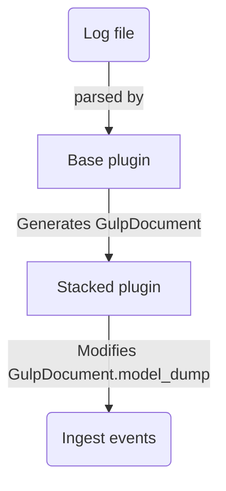

- [plugins](#plugins)
  - [loading plugins](#loading-plugins)
    - [load order](#load-order)
  - [plugin types](#plugin-types)
    - [ingestion](#ingestion)
    - [external](#external)
    - [extension](#extension)
    - [enrichment](#enrichment)
    - [ui plugins](#ui-plugins)
- [architecture](#architecture)
  - [plugin internals](#plugin-internals)
    - [ingestion plugins](#ingestion-plugins)
    - [external plugins](#external-plugins)
    - [extension plugins](#extension-plugins)
    - [enrichment plugins](#enrichment-plugins)
  - [mapping files](#mapping-files)
    - [mapping files load order](#mapping-files-load-order)
    - [example](#example)
  - [stacked plugins](#stacked-plugins)
    - [flow](#flow)
  - [extension plugins](#extension-plugins-1)
- [addendum](#addendum)
  - [external queries](#external-queries)

# plugins

gulp is made of plugins, each serving different purposes:

- `ingestion` plugins for ingesting data from local sources (i.e. log files)
- `external` plugins to query external sources (i.e. a SIEM), and possibly ingest data into gulp at the same time
- `extension` plugins to extend the gulp [REST api](../src/gulp/api/rest/)
- `ui` plugins to extend the [frontend](https://github.com/mentat-is/gulpui-web) (*just served, not used by the backend*)

## loading plugins

plugins directory tree is as follows:

- `ingestion` and `external` directories are in the top level `plugins directory`
- `ui` and `extension` plugins are in the `ui` and `extension` directories respectively

```text
<plugins directory>
|
|__extension
|  |__<extension plugins here>
|__ui
|  |__<extension plugins here>
|
|__<ingestion_plugin_a>
|__<ingestion_plugin_b>
|__<external_plugin_a>
|__<external_plugin_b>

```

### load order

if an `extra` plugin directory is defined (either via environment `PATH_PLUGINS_EXTRA` or `path_plugins_extra` in the configuration file), plugins are first searched there before the main plugins directory `$GULPDIR/src/gulp/plugins`.

> this allows to override specific plugins with i.e. new versions or just to add further plugins to the default set.

## plugin types

gulp support different plugin types, even if they share all [the same architecture](../src/gulp/plugin.py).

### ingestion

- Apache's standard `access.log` and `error.log`
- Windows `evtx`
- Windows `registry` hives
- Systemd `journal` files
- A few of the Zimmerman tools' output files
- A few Autopsy exports files
- Chrome `history` and `webdata` db files
- Network capture `pcap` and `pcapng` files
- Email message boxes using `mbox` and plain `eml` files
- Teamviewer's `connection_incoming.txt`

Along side the specific ones we also provide some generic "base" plugins which can be used as a base to build your own plugins!

- Generic `sqlite` databases
- Generic single-line text files via the `regex` plugin
- Generic `csv` files

### external

- `elasticsearch` to query and ingest from an external source based on `Elasticsearch` or `Opensearch` (i.e. Wazuh)

### extension

- use [`example`](../src/gulp/plugins/extension/example.py) plugin as a base, currently we have extension plugins (i.e. support for `OAUTH` login) on our paid offer only.

### enrichment

- [enrich_whois](../src/gulp/plugins/enrich_whois.py) to enrich one or more documents with whois information
- ...

### ui plugins

this is a `special` type of plugin which resides in `PLUGIN_DIR/ui` and allows the UI to have customized layouts for particular needs.

> this is documented in the [UI repository](https://github.com/mentat-is/gulpui-web/blob/develop/docs/PLUGINS.md) since they're not used at all by the backend, they are just listed via the `ui_plugin_list` API.

# architecture

While plugins can be as complex as needed, a basic plugin **must** implement the functions:

- `display_name`: returns the display name of the plugin
- `type`: may be `ingestion`, `extension`, `external`
- `_record_to_gulp_document`: this is called automatically by the engine on each record in the source being processed

then, different methods may be implemented:

- `ingest_file`: implemented in `ingestion` plugins, this is the entrypoint to ingest a file.
  - look in [win_evtx](../src/gulp/plugins/win_evtx.py) for a complete example.

- `ingest_raw`: may be implemented in `ingestion` plugins to allow ingestion of `raw` data, which the plugin turns into proper `GulpDocuments`
  - this is currently used only by the [raw](../src/gulp/plugins/raw.py) plugin.
  
- `query_external`: implemented by `external` plugins, queries (and possibly ingest from, at the same time) an external source.
  - look in [elasticsearch](../src/gulp/plugins/elasticsearch.py) for a complete example.
  - `GulpQueryExternalParameters` holds parameters to query the external source, including the `plugin` and `GulpPluginParameters` to be used.

- `enrich_documents` and `enrich_single_document`: implemented in `enrichment` plugins to enrich one or more document.

other *optional* methods to implement are:

- `custom_parameters`: returned by the `plugin_list` API, this defines each custom parameter the plugin support and may be used by the UI to build a configurator for the plugin.
  - they are passed to the plugin via `GulpPluginParameters.custom_parameters` dict.
  - they are available to the plugin at runtime (after `_initialize` has been called)  via `self._plugin_params.custom_parameters`.

- `tags`: returned by the `plugin_list` API, defines tags to categorize the plugin
- `version`: the plugin version string
- `desc`: the plugin description
- `depends_on`: if the plugin dependens on other plugins, they are listed here.

> a plugin may be of mixed types too: nothing stop to implement both `ingest_file`, `ingest_raw` and `query_external` in a single plugin, and declare its type as `[`ingestion`, `external`]

## plugin internals

the base class [GulpPluginBase](../src/gulp/plugin.py) handles most of the complex orchestration while the plugin focuses on the external source specific implementations.

the base class provides:

- Document buffering and batch processing
- Websocket streaming
- Ingestion into Gulp's Opensearch
- Statistics tracking
- Mapping file handling

the plugins must implement:

- for `ingestion` plugins:
  - format parser to extract single records.
- for `external` plugins:
  - the logic to connect to the external server.
  - query conversion
  - record format conversion
- for `enrichment` plugins:
  - the logic to enrich a set of documents
- for `extension` plugins, they may install additional `API routes` during gulp initialization.

### ingestion plugins

ingestion plugins must implement `ingest_file` and/or `ingest_raw` (the ingestion entrypoints).

optionally, `ingestion` plugins may implement:

- `_enrich_documents_chunk` to perform enrichment before storing each chunk in gulp's Opensearch.

this is how the data flows through an `ingestion plugin` when ingesting into gulp through `ingest_file` API.

~~~mermaid
sequenceDiagram
    participant Engine as Gulp Engine
    participant Base as GulpPluginBase
    participant Plugin as Plugin
    participant Parser as Format parser
    participant Mapper as Field Mapper
    participant Enrich as Enrichment

    Engine->>Plugin: ingest_file(file_path)
    Plugin->>Base: super().ingest_file()
    Base-->>Plugin: Initialize state
    Plugin->>Base: _initialize()
    Base-->>Plugin: Load windows.json mappings

    Plugin->>Parser: Initialize source file parser

    loop For each record
        Parser-->>Plugin: Get next record
        Plugin->>Plugin: _record_to_gulp_document()
        Plugin->>Plugin: Parse event data

        loop For each record element
            Plugin->>Base: _process_key()
            Base->>Mapper: Map fields to ECS
            Mapper-->>Plugin: Return mapped fields
        end

        Plugin->>Plugin: _map_evt_code()
        Plugin->>Base: process_record()
        Base->>Base: Buffer records
        opt When buffer full
            Base->>Base: _flush_buffer()
            Base-->>Enrich: _enrich_documents_chunk(), if implemented
            Enrich-->>Base: Return enriched documents
            Base->>Base: _ingest_chunk_and_or_send_to_ws()
            Base-->>Engine: Stream to websocket
            Base-->>Engine: Ingest to OpenSearch
        end
    end

    Plugin->>Base: _source_done()
    Base-->>Engine: Send completion status
~~~

### external plugins

this is how the data flows through an `external plugin` when querying (and possibly ingesting from) an external source.

~~~mermaid
sequenceDiagram
    participant Engine as Gulp Engine
    participant Base as GulpPluginBase
    participant Plugin as ExternalSource Plugin
    participant ExternalSource as External Server

    Engine->>Plugin: query_external()
    Plugin->>Base: super().query_external()
    Base-->>Plugin: Initialize state
    Plugin->>Base: _initialize()
    Base-->>Plugin: Load mappings

    Plugin->>ExternalSource: Connect & execute query
    ExternalSource-->>Plugin: Stream results

    loop For each record
        Plugin->>Plugin: _record_to_gulp_document()
        Plugin->>Base: process_record()
        Base->>Base: Buffer records
        Base->>Base: _ingest_chunk_and_or_send_to_ws()
        Base-->>Engine: Stream to websocket
        opt If ingestion enabled
            Base-->>Engine: Ingest to OpenSearch
        end
    end

    Plugin->>Base: _source_done()
    Base-->>Engine: Send completion status
~~~

### extension plugins

> this is [just an example](../src/gulp/plugins/extension/example.py) which adds a REST API entrypoint and runs sample code in a worker when the API is called.

~~~mermaid
sequenceDiagram
    participant App as FastAPI App
    participant Plugin as Extension Plugin
    participant Base as GulpPluginBase
    participant Worker as Worker Process
    participant WS as WebSocket Queue

    Note over Plugin: Plugin Initialization
    Plugin->>Base: Inherit from GulpPluginBase
    Plugin->>Base: super().__init__(path, pickled)

    alt Main Process Init
        Plugin->>App: _add_api_routes()
        App-->>Plugin: Register /example_extension endpoint
    else Worker Process Init
        Plugin->>Plugin: Re-initialize in worker
    end

    Note over Plugin: API Request Handling
    App->>Plugin: example_extension_handler()
    Plugin->>Base: Check user session
    Plugin->>Worker: Spawn _example_task in worker

    Worker->>Worker: _run_in_worker()
    Worker->>WS: Send updates via WebSocket

    Worker-->>Plugin: Task completion
    Plugin-->>App: Return JSendResponse
~~~

### enrichment plugins

enrichment plugins takes one or more `GulpDocuments` and returns them augmented with extra data.

they must implement `enrich_documents`, `enrich_single_documents` and `_enrich_documents_chunk`.

> a plugin may support both `enrichment` and `ingestion` by declaring its `type` as `[GulpPluginType.INGESTION, GulpPluginType.ENRICH]` and implement both types entrypoints.

a preliminary example is [here](../src/gulp/plugins/enrich_example.py).

## mapping files

`ingestion` and `external` plugins both support mapping files through [GulpPluginParameters](../src/gulp/structs.py), to customize mapping for both ingested documents and/or documents returned from an `external` query.

mapping files may be used standalone (i.e. with the `csv` plugin without having another plugin) or together with an existing one by setting parameters when the plugin calls `_initialize`.

a mapping file basically instructs an existing plugin how to parse fields from the log, using a simplified `json` stucture.

while making mappings, try to adhere to one of the following conventions (ordered from most to least preferred):

  1. `ECS` standard defined by elastic [here](https://www.elastic.co/guide/en/ecs/current/index.html)
  2. `gulp.<meaningful_name>.*` such as `gulp.http.query.params.<name>` or `gulp.pcap.<protocol>.field`
  3. anything else

remember, the more standardized the logs we collect are, the easier it will be to create and share detection rules and query snippets!

> [Mapping files](../src/gulp/mapping_files/) are extremely useful when using a base plugin such as the `csv`, `sqlite` or `regex` plugins.

### mapping files load order

mapping files load order follows the same rules as [plugins](#loading-plugins):

if an `extra` mapping directory is defined (either via environment `PATH_MAPPING_FILES_EXTRA` or `path_maping_files_extra` in the configuration file), mapping files are first searched there before the main mapping files directory `$GULPDIR/src/gulp/mapping_files`.

### example

Here's a commented example, further details in the [model definition source](../src/gulp/api/mapping/models.py)

```json
{
  "metadata": {
    // lists the plugins this mapping file supports: this allows the UI to correlate plugins and mapping files via the `mapping_file_list` API
    "plugin": [
      "sqlite.py"
    ]
  },
  // one or more supported mappings, each key is a `mapping_id`
  "mappings": {
    // the `mapping_id`
    "autofill": {
      // optional: if set, sets `event.code` for all(*) the documents generated by this mapping. either, it is plugin responsibility to set it.
      // (*): this is ignored for extra documents generated with `extra_doc_with_event_code`, as explained later.
      "event_code": "autofill_date_created",
      // optional: if set, sets `agent.type` for all the documents generated by this mapping. either, it is plugin responsibility to set it.
      "agent_type": "chromium",
      // optional: if set, matching fields in the source document are ignored and not included in the generated document/s.
      "exclude": ["field1", "field2"],
      // optional: if set, only matching fields in the source document are processed and included in the generated document/s.
      "include": ["field1", "field2"],
      // if "allow_prefixed" is set, only the last part after "_" of the source key is considered for matching ecs mapping: i.e. if source key is "hello_world", only "world" is considered.
      "allow_prefixed": true

      // the fields to map: source fields not listed here will be stored with `gulp.unmapped.` prefix.
      "fields": {
        // the field name
        "name": {
          // this may be a string or a []: this allows mapping a single field to one or more target document fields.
          "ecs": "gulp.html.form.field.name"
        },
        "value": {
          "ecs": "gulp.html.form.field.value",
          // if "force_type" is set, value is converted to "int", "str" or "float" PRIOR to being ingested
          "force_type": "int"
        },
        "date_created": {
          // since in gulp every document needs at least a "@timestamp", either it is mapped here to a field or it is the responsibility of the plugin to set it.
          // the engine, with the plugin's cooperation if needed, will take care of the necessary conversion ("@timestamp" is stored as an ISO-8601 string) and also generates `gulp.timestamp` as `nanoseconds from unix epoch`.
          "ecs": "@timestamp",
          // this is a special flag to indicate the **original** timestamp (prior to gulp's processing) is an int or a numeric string and needs to be multiplied: this may also be a fraction (i.e. 0.5) to indicate division.
          "multiplier": 1000000000
        },
        "a_chrome_timestamp": {
          "ecs": "chrome_ts",
          // this is a special flag to indicate the **original** timestamp (prior to gulp's processing) is a `webkit` timestamp from 1601, so gulp will perform the necessary conversions.
          "is_timestamp_chrome": true
        },
        "date_last_used": {
          // if "extra_doc_with_event_code" is set, this field represents a timestamp and a further document will be generated alongside the `main` document.
          //
          // in this example, in the extra document the following will be set:
          //
          // - "@timestamp" will be set to this "date_last_used" value (flags like `multiplier` or `is_timestamp_chrome` are processed as well, if set)
          // - "event.code" will be set to "autofill_date_last_used" (so the mapping's `event_code` flag above is ignored here)
          //
          // for this to work, one main timestamp must be selected as the main and mapped as "@timestamp", i.e.
          //
          // "field_name": {
          //    "ecs": "@timestamp"
          // }
          //
          // and mapping's "event_code" must be set to indicate the main `event.code`.
          //
          // setting `extra_doc_with_event_code` for multiple fields allows to generate multiple documents from a single source (i.e. if an event has multiple timestamp like `creation_time`, `modify_time`, ...)
          //
          "extra_doc_with_event_code": "autofill_date_last_used",
          "multiplier": 1000000000,
        }
      }
    }
  },
  // this is used only by `sigma_query` API: it allows, during conversion of a sigma query to a raw OpenSearch query, to target documents with a specific sigma `logsource.service`. 
  "sigma_mappings": {
    // this is the `logsource.service" listed in the sigma rule
    "service_name": "windefend",
    // this is the FIELD NAME in the documents
    "service_name": "winlog.channel",
    // these are possible values for FIELD NAME in the documents (they're matched as substring CASE SENSITIVE)
    // basically, the sigma is "patched" after conversion to match only documents with i.e. `winlog.channel` = any of the values in `service_values`.
    "service_values": [
        "Microsoft-Windows-Windows Defender",
    ]
  }

}
```

## stacked plugins

plugins may be stacked one on top of the another, as a `lower` and `higher` plugin: the idea is the `higher` plugin has access to the data processed by `lower` and can process it further.

Stacked plugins are usually based on generic python *ingestion* plugins such as `csv`, `sqlite`.

An example of a basic extension plugin is [stacked_example](../src/gulp/plugins/stacked_example.py), or for a real one you may look at [chrome_history](../src/gulp/plugins/chrome_history_sqlite_stacked.py) which sits on top of the [sqlite](../src/gulp/plugins/sqlite.py) plugin.

### flow

stacking is handled by the engine, which basically does this `for every record` being processed in the source document:

- calls plugin's own `_record_to_gulp_document`
- if there is a plugin stacked on top, calls its `_record_to_gulp_document` with the `GulpDocument` returned as `dict`.
- if the stacked plugin also implements `_enrich_documents_chunk`, this is called with each chunk of documents`right before` storing into gulp.



so, basically, as every other plugin they must implement `_record_to_gulp_document`, but instead of a `GulpDocument` object they receives (and returns) `record` as its `dict` representation: here they can postprocess the record (i.e. change/add/delete fields).

- they must call `setup_stacked_plugin(lower_plugin)` in their `ingest_file`, `ingest_raw`, `query_external` entrypoints (depending on where it is needed)

- some plugins may want to bypass the engine and call lower's `_record_to_gulp_document` by itself: so, they must use `load_plugin` instead of `setup_stacked_pugin` in their initialization: for an example of this, look at the [mbox](../src/gulp/plugins/mbox.py) which sits on top of the [eml](../src/gulp/plugins/eml.py) plugin.

## extension plugins

extensions plugins starts with gulp and mostly runs **in the main process context**, even if it is supported to spwan them across worker processes.

they may be used to extend gulp API, i.e. implement new sign-in code, ...

# addendum

## external queries

to query an external source with an `external plugin`, we use the `query_external` API:

1. specify the `plugin` to be used (must implement `query_external`)
2. pass the specific `GulpPluginParameters.custom_parameters`, which may include i.e. `uri`, `username`, `password` to allow the plugin to connect to the external source
3. pass the `q` parameter, which is the query in the `external specific DSL(Domain Specific Language) format`.
4. optionally pass the `q_options` parameter, which controls how the query is performed (*not all parameters may be supported by the plugin*)
5. optionally pass `ingest=True` to ingest data into gulp while querying.

> look at [test_elasticsearch](../tests/query.py) in the query tests for an example usage

