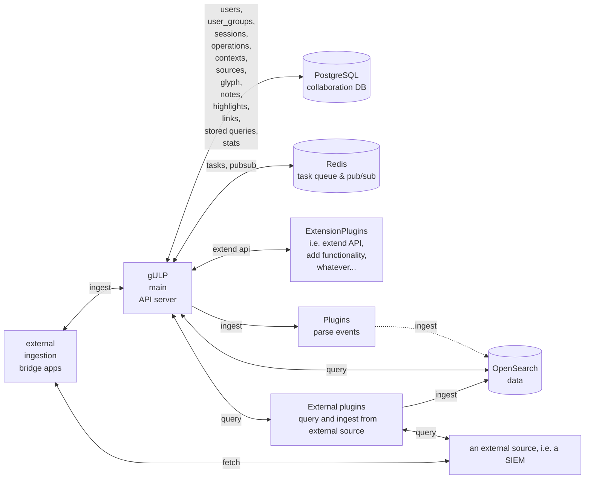
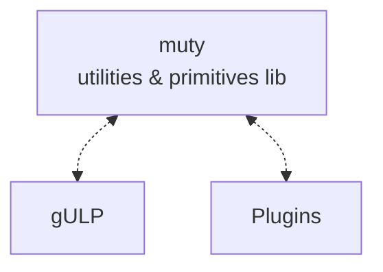
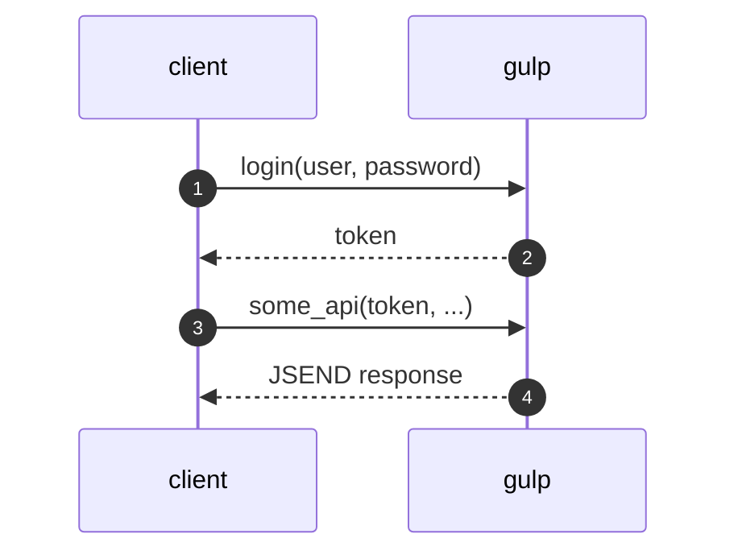
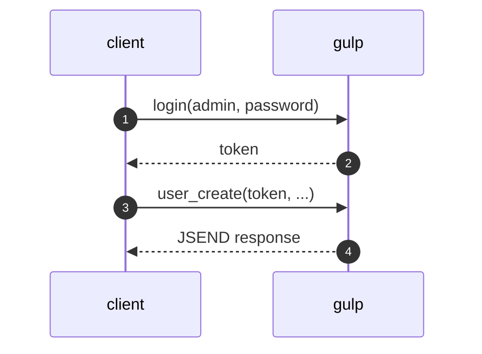
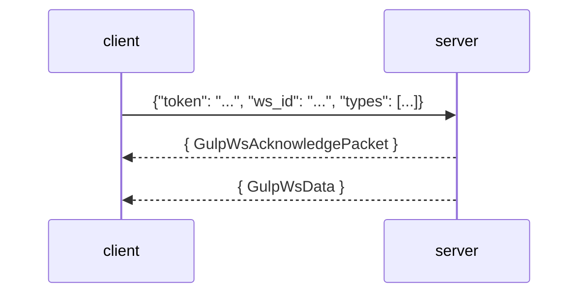
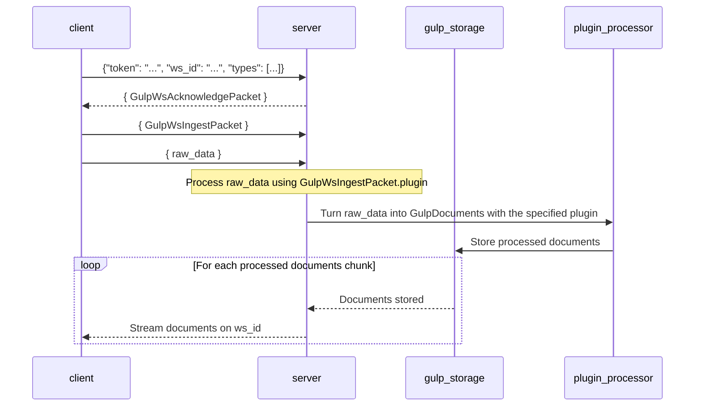
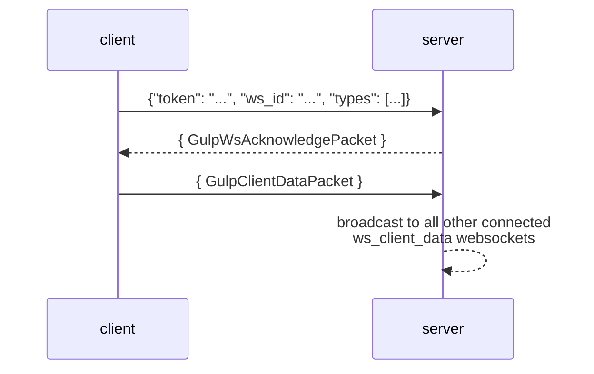

- [GULP architecture](#gulp-architecture)
- [API](#api)
  - [API flow](#api-flow)
  - [websocket](#websocket)
    - [ws](#ws)
    - [ws\_ingest\_raw](#ws_ingest_raw)
    - [ws\_client\_data](#ws_client_data)
    - [tracking status](#tracking-status)

## GULP architecture

TLDR :)



Task queue and pub/sub:
- gULP uses Redis for both the ingestion task queue and lightweight pub/sub.
- Ingestion requests enqueue task dictionaries on a Redis list (key `gulp:queue:tasks`).
- The main process polls the Redis queue and dispatches tasks to worker processes.
- Redis pub/sub is used for WebSocket fan-out and inter-instance coordination.

All components are based on the [muty utility library](https://github.com/mentat-is/muty-python)



## API

Once you start gulp, the api is available via the [openapi](http://localhost:8080/openapi.json) endpoint.

### API flow



users must be created first with an ADMIN account



### websocket

#### ws

The endpoint `/ws` provides live feedback and results for _ingestion_, _queries_ and _collaboration objects_ via websocket:

> `ws_id` is optional `on connecting` and will be autogenerated (and returned) by the server if not provided.



Response from the websocket is a [GulpWsData](../src/gulp/api/ws_api.py) object like the following:

> the `data` object in this case is a [WSDATA_STATS_UPDATE](../src/gulp/api/ws_api.py) containing a [GulpRequestStats](../src/gulp/api/collab/stats.py) object.

```json
{
  "@timestamp": 1735480177594,
  "type": "stats_update",
  "ws_id": "test_ws",
  "user_id": "ingest",
  "req_id": "test_req",
  "data": {
    "data": {
      "status": "ongoing",
      "time_expire": 1735566576328,
      "time_finished": 0,
      "source_processed": 0,
      "source_total": 1,
      "source_failed": 0,
      "records_failed": 0,
      "records_skipped": 0,
      "records_processed": 1000,
      "records_ingested": 1000,
      "id": "test_req",
      "type": "request_stats",
      "owner_user_id": "ingest",
      "granted_user_ids": [],
      "granted_user_group_ids": [],
      "time_created": 1735480176329,
      "time_updated": 1735480177589,
      "name": "test_req",
      "gulp.operation_id": "test_operation",
      "gulp.context_id": "66d98ed55d92b6b7382ffc77df70eda37a6efaa1"
    }
  }
}
```

#### ws_ingest_raw

`ws_ingest_raw` is a websocket specifically meant to ingest `raw` data in any format.

the websocket must be fed with JSON data (`GulpWsIngestPacket`) followed by a `bytes` chunk (the raw data itself).

```js
 {
      "index": "TEST_INDEX",
      "operation_id": "TEST_OPERATION_ID",
      "context_name": "context_name",
      "source": "source_name",
      "ws_id": "TEST_WS_ID", // this is the `ws_id` to stream the ingestion data to
      "flt": null
      "plugin": "raw", // default uses the `raw` plugin, which expects the chunk of data to be a list of GulpDocument dictionaries
      "plugin_params": null 
  }
  // bytes chunk follow
```


the following is the ingestion flow:



#### ws_client_data

`ws_client_data` is a websocket specifically for the client broadcast arbitrary data among other connected clients.



each `GulpClientDataPacket` is as follows:

```json
{
  "data": { "arbitrary": "data" }
}
```

#### tracking status

a client can keep track of operations [via data sent by gulp on the connected websockets](../src/gulp/api/ws_api.py#WS_DATA_STATS_UPDATE) during operations (i.e. queries, ingestion, ...)