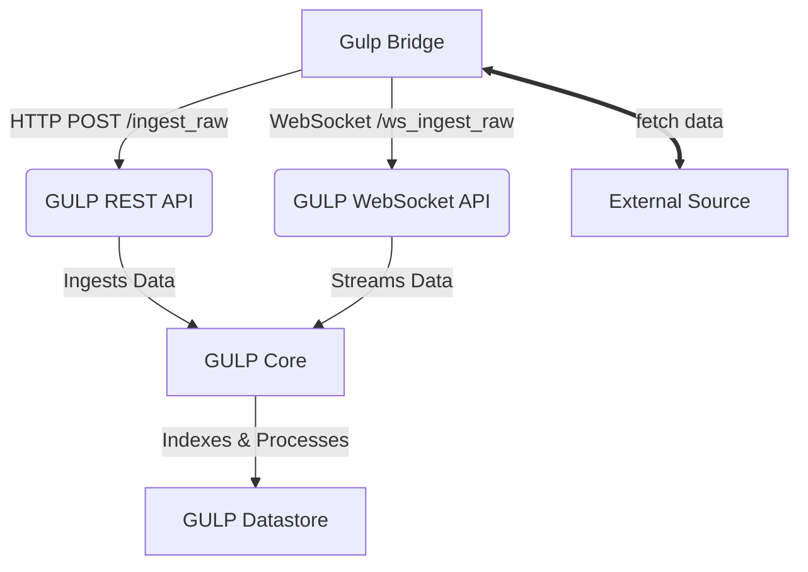

- [integrate with other applications](#integrate-with-other-applications)
  - [gulp bridges](#gulp-bridges)
  - [the raw plugin](#the-raw-plugin)
    - [using a custom raw ingestion plugin](#using-a-custom-raw-ingestion-plugin)
  - [flow](#flow)
    - [completing raw requests](#completing-raw-requests)

# integrate with other applications

## gulp bridges

while integration with an external application may be done using an [external plugin](./plugins_and_mapping.md#external-plugins), this may not be possible due to the external application not exposing a proper API or method to access the data.

so, it is possible to create a `bridge` between gulp and the external application using custom methods (depending on the source) to access the data and then feed it to gulp via the `REST API`.

> ideally, a gulp bridge should be a `microservice` running alongside gulp, possibly exposing itself an API for integration.
>

to ease developing bridges using python, a [WIP gulp SDK](https://github.com/mentat-is/gulp-sdk-python) is in the works.

this guide explains how to perform the integration leveraging the `/ingest_raw` and/or the WebSocket endpoint `/ws_ingest_raw` to feed the data from a `gulp bridge`.

## the raw plugin

when ingesting data using the [/ingest_raw](../src/gulp/api/rest/ingest.py) API or [/ws_ingest_raw](../src/gulp/api/rest/ws.py) WebSocket, by default the [raw plugin](../src/gulp/plugins/raw.py) plugin is used and it expects data chunks as **lists of dictionaries in the GulpDocument format**.

these dictionaries should be created by your agent or bridge application and must include all the required fields in a [GulpDocument](../src/gulp/api/opensearch/structs.py).

> **GULP will not transform these documents**: it will only recreate the `_id` field and, if needed, create `GulpContext` and `GulpSource` objects from the `gulp.context_id` and `gulp.source_id` fields if they do not already exist.

### using a custom raw ingestion plugin

if you need to ingest i.e. custom binary chunks, you can implement your own plugin to process those bytes or structures as needed and use it in place of the `raw` plugin: just set the `plugin` parameter in both `/ingest_raw` or `/ws/ingest_raw`.

## flow

as specified above, GULP supports real-time and batch ingestion of data from external sources via:

- **REST API** (`/ingest_raw`): For sending data chunks via HTTP POST requests.
- **WebSocket** (`/ws_ingest_raw`): For streaming data in real-time.

below is a diagram illustrating the typical data flow for ingestion using a `bridge`:

examples for both methods are provided in the test code:

- [/ingest_raw](../tests/ingest/test_ingest.py#async-def-test_raw)
- [for /ws/ingest_raw](../tests/ingest/test_ingest.py#async-def-test_ws_raw)

> for `/ws/ingest_raw`, [here is the detailed inner working of the endpoint](../src/gulp/api/rest/ws.py#async_def_ws_ingest_raw_handler)

### completing raw requests

raw ingestion, by its nature, keeps the related [GulpRequestStats](../src/gulp/api/collab/stats.py) (the structure used to keep track of each request gulp is processing) always in the `ongoing` state.

> once a request `status` turns to `done`, `failed`, `canceled`, the engine takes care of deleting the completed requests after their `expire_time` is due: this is done automatically for non-raw requests (i.e. ingest, query, ...).

while using the `/ws/ingest_raw` also handles this automatically when the websocket is closed, using the `/ingest_raw` REST endpoint the client must notify gulp when the request is done (so it can clean it up later).

this may be done both via:

- setting the `last` parameter when calling `/ingest_raw` (**the preferred way**)
- using the provided `/request_set_completed` REST API
