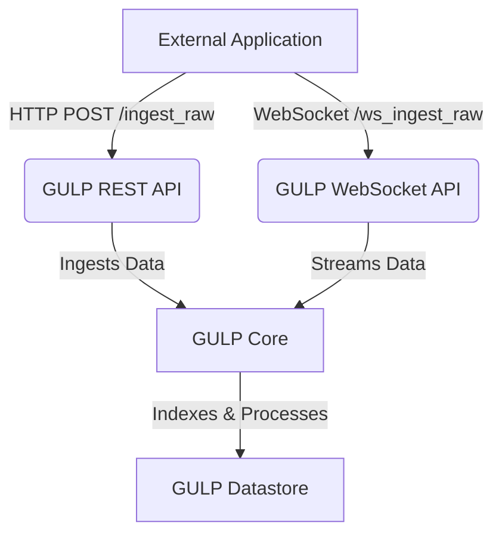

# integrate with other applications

this guide explains how to integrate Gulp with another application (i.e. a SIEM, an external bridge, ...) which uses the provided REST API (`/ingest_raw`) and/or the WebSocket endpoint (`/ws_ingest_raw`) to feed the data.

## the raw plugin

when ingesting data using the [/ingest_raw](../src/gulp/api/rest/ingest.py) API or [/ws_ingest_raw](../src/gulp/api/rest/ws.py) WebSocket, by default the [raw plugin](../src/gulp/plugins/raw.py) plugin is used and it expects data chunks as **lists of dictionaries in the GulpDocument format**.

these dictionaries should be created by your agent or bridge application and must include all the required fields in a [GulpDocument](../src/gulp/api/opensearch/structs.py).

> **GULP will not transform these documents**: it will only recreate the `_id` field and, if needed, create `GulpContext` and `GulpSource` objects from the `gulp.context_id` and `gulp.source_id` fields if they do not already exist.

### using a custom raw ingestion plugin

if you need to ingest i.e. custom binary chunks, you can implement your own plugin to process those bytes or structures as needed and use it in place of the `raw` plugin: just set the `plugin` parameter in both `/ingest_raw` or `/ws/ingest_raw`.

## flow

as specified above, GULP supports real-time and batch ingestion of data from external sources via:

- **REST API** (`/ingest_raw`): For sending data chunks via HTTP POST requests.
- **WebSocket** (`/ws_ingest_raw`): For streaming data in real-time.

below is a diagram illustrating the typical data flow for ingestion:

examples for both methods are provided in the test code:

- [/ingest_raw](../tests/ingest/test_ingest.py#async-def-test_raw)
- [for /ws/ingest_raw](../tests/ingest/test_ingest.py#async-def-test_ws_raw)

> for `/ws/ingest_raw`, [here is the detailed inner working of the endpoint](../src/gulp/api/rest/ws.py#async_def_ws_ingest_raw_handler)
