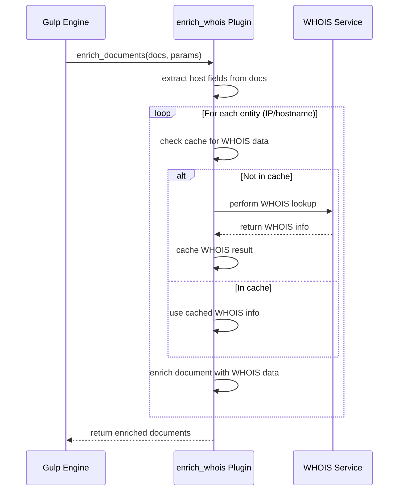
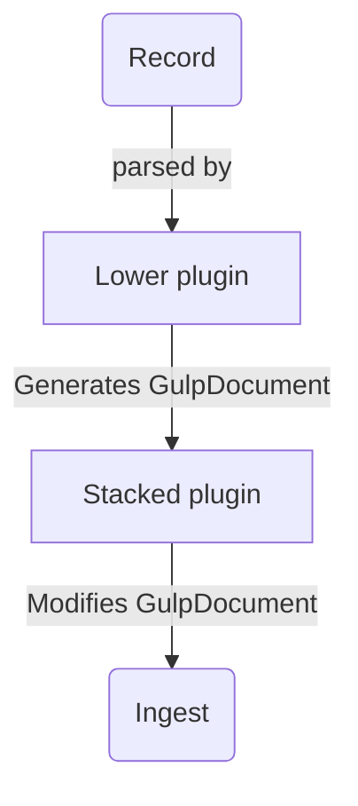

- [plugins](#plugins)
  - [loading plugins](#loading-plugins)
    - [load order](#load-order)
  - [plugin types](#plugin-types)
    - [ingestion](#ingestion)
    - [external](#external)
    - [extension](#extension)
    - [enrichment](#enrichment)
    - [ui plugins](#ui-plugins)
- [architecture](#architecture)
  - [plugin internals](#plugin-internals)
    - [multiprocessing and concurrency](#multiprocessing-and-concurrency)
    - [ingestion plugins](#ingestion-plugins)
      - [chunk callbacks](#chunk-callbacks)
    - [enrichment plugins](#enrichment-plugins)
    - [external plugins](#external-plugins)
      - [call external plugins](#call-external-plugins)
    - [extension plugins](#extension-plugins)
  - [stacked plugins](#stacked-plugins)
    - [flow in stacked plugins](#flow-in-stacked-plugins)
- [mapping 101](#mapping-101)
  - [mapping files](#mapping-files)
    - [select a mapping](#select-a-mapping)
    - [mapping files load order](#mapping-files-load-order)
  - [advanced mapping](#advanced-mapping)
    - [context and source](#context-and-source)
  - [mapping file example](#mapping-file-example)

# plugins

gulp is made of plugins, each serving different purposes:

- `ingestion` plugins for ingesting data from local sources (i.e. log files)
- `external` plugins to query external sources (i.e. a SIEM), and possibly ingest data into gulp at the same time
- `extension` plugins to extend the gulp [server API](../src/gulp/api/server/)
- `ui` plugins to extend the [frontend](https://github.com/mentat-is/gulpui-web) (*just served, not used by the backend*)

## loading plugins

plugins directory tree is as follows:

- `ingestion` and `external` directories are in the top level `plugins directory`
- `ui` and `extension` plugins are in the `ui` and `extension` directories respectively

```text
<plugins directory>
|
|__extension
|  |__<extension plugins here>
|__ui
|  |__<extension plugins here>
|
|__<ingestion_plugin_a>
|__<ingestion_plugin_b>
|__<external_plugin_a>
|__<external_plugin_b>

```

### load order

a plugin is first attempted to load from `$GULP_WORKING_DIR/plugins` to allow overriding (i.e. with new/bugfixed versions).

if not found there, the plugin is attempted to load from the main `$INSTALLDIR/plugins` directory (which, by convention, **should not be writable**).

## plugin types

gulp support different plugin types, even if they share all [the same architecture](../src/gulp/plugin.py).

### ingestion

- Apache's standard `access.log` and `error.log`
- Windows `evtx`
- Windows `registry` hives
- Systemd `journal` files
- A few of the Zimmerman tools' output files
- A few Autopsy exports files
- Chrome `history` and `webdata` db files
- Network capture `pcap` and `pcapng` files
- Email message boxes using `mbox` and plain `eml` files
- Teamviewer's `connection_incoming.txt`

Along side the specific ones we also provide some generic "base" plugins which can be used as a base to build your own plugins!

- Generic `sqlite` databases
- Generic single-line text files via the `regex` plugin
- Generic `csv` files

### external

- `elasticsearch` to **query and ingest** from an external source based on `Elasticsearch` or `Opensearch` (i.e. Wazuh)

### extension

- use [`example`](../src/gulp/plugins/extension/example.py) plugin as a base, currently we have extension plugins (i.e. support for `OAUTH` login) on our paid offer only.

### enrichment

- [enrich_whois](../src/gulp/plugins/enrich_whois.py) to enrich one or more documents with whois information
- ...

### ui plugins

this is a `special` type of plugin which resides in `PLUGIN_DIR/ui` and allows the UI to have customized layouts for particular needs.

> this is documented in the [UI repository](https://github.com/mentat-is/gulpui-web/blob/develop/docs/PLUGINS.md) since they're not used at all by the backend, they are just listed via the `ui_plugin_list` API.

# architecture

While plugins can be as complex as needed, a basic plugin **must** implement the functions:

- `display_name`: returns the display name of the plugin
- `type`: may be `ingestion`, `extension`, `external`
- `_record_to_gulp_document`: this is called automatically by the engine on each record in the source being processed

then, different methods may be implemented:

- `ingest_file`: implemented in `ingestion` plugins, this is the entrypoint to ingest a file.
  - look in [win_evtx](../src/gulp/plugins/win_evtx.py) for a complete example.

- `ingest_raw`: may be implemented in `ingestion` plugins to allow ingestion of `raw` data, which the plugin turns into proper `GulpDocuments`
  - this is currently used only by the [raw](../src/gulp/plugins/raw.py) plugin.

- `query_external`: implemented by `external` plugins, queries and ingest from an external source.
  - look in [elasticsearch](../src/gulp/plugins/elasticsearch.py) for a complete example.
  - `GulpQueryExternalParameters` holds parameters to query the external source, including the `plugin` and `GulpPluginParameters` to be used.

- `enrich_documents` and `enrich_single_document`: implemented in `enrichment` plugins to enrich one or more document.

other *optional* methods to implement are:

- `custom_parameters`: returned by the `plugin_list` API, this defines each custom parameter the plugin support and may be used by the UI to build a configurator for the plugin.
  - they are passed to the plugin via `GulpPluginParameters.custom_parameters` dict.
  - they are available to the plugin at runtime (after `_initialize` has been called)  via `self._plugin_params.custom_parameters`.

- `tags`: returned by the `plugin_list` API, defines tags to categorize the plugin
- `version`: the plugin version string
- `desc`: the plugin description
- `depends_on`: if the plugin dependens on other plugins, they are listed here.

> look at [GulpPluginBase](../src/gulp/plugin.py) for a complete list of methods and properties a plugin may implement.

## plugin internals

the base class [GulpPluginBase](../src/gulp/plugin.py) handles most of the complex orchestration while the plugin focuses on the external source specific implementations.

the base class provides:

- Document buffering and batch processing
- Websocket streaming
- Ingestion into Gulp's Opensearch
- Statistics tracking
- Mapping file handling

the plugins must implement:

- for `ingestion` plugins:
  - format parser to extract single records.
- for `enrichment` plugins:
  - the logic to enrich one or more documents
- for `external` plugins:
  - the logic to connect to the external server.
  - query conversion
  - record format conversion
- for `extension` plugins, they may install additional `API routes` during gulp initialization.

### multiprocessing and concurrency

`ingest_file`, `query_external` are guaranteed to be called in a task running in a *worker process*, so each ingest/query operation will run in parallel, unless `preview_mode` is set.

> gulp spawns different worker processes at startup (controlled by `parallel_processes_max` in the configuration) to maximize the usage of available cores, using both `multiprocessing` and `asyncio` to run lenghty operations (queries, ingestion) `concurrently` and in `parallel` as much as possible.

following are basic rules to use multiprocessing and concurrency effectively in gulp plugins:

- both `main` and `worker` processes can spawn `background async tasks` which runs in the current process without blocking the process event loop.

  ```python
  async def fun(param1, param2):
      ...
  coro = fun()
  GulpApiRestServer.spawn_bg_task(coro)
  ```

- moreover, a dedicated `thread pool` is also available for both `main` and `worker` processes.

  ```python
  # for example, a running task may run code in a separated thread
  loop = asyncio.get_running_loop()
  fut: asyncio.Future = loop.run_in_executor(
      GulpProcess.get_instance().thread_pool,
      self._read_file,
      q,
      file_path,
      encoding,
      keys,
  )
  ```

  > for an example on how to effectively use another thread, look at the [json plugin](../src/gulp/plugins/json.py)

- **in the main process only**, a plugin may also run a coroutine in one of the worker processes using the `process` pool.

  ```python
    async def fun(param1, param2, param3):
        ...
    
    # run fun in an async task in a worker process, thanks to aiomultiprocess
    await GulpServer.get_instance().spawn_worker_task(fun, param1, param2, param3)
  ```

- in `external`, `ingestion`, `enrich` plugins a `collab` session is guaranteed to exist when `ingest_file`, `ingest_raw`, `query_external`, `enrich_documents` are called: **this session is valid in the `current running` task only**.

### ingestion plugins

`ingestion` plugins must implement `ingest_file` and/or `ingest_raw` (the ingestion entrypoints).

this is how the data flows through an `ingestion plugin` when ingesting into gulp through `ingest_file` API.

~~~mermaid
sequenceDiagram
    participant Engine as Gulp Engine
    participant Base as GulpPluginBase
    participant Plugin as Plugin
    participant Parser as Format parser
    participant Mapper as Field Mapper

    Engine->>Plugin: ingest_file(file_path)
    Plugin->>Base: super().ingest_file()
    Base-->>Plugin: Initialize state
    Plugin->>Base: _initialize()
    Base-->>Plugin: Load mappings

    Plugin->>Parser: Initialize source file parser

    loop For each record
        Parser-->>Plugin: Get next record
        Plugin->>Plugin: _record_to_gulp_document()
        Plugin->>Plugin: Parse event data

        loop For each record element
            Plugin->>Base: _process_key()
            Base->>Mapper: Map fields to ECS
            Mapper-->>Plugin: Return mapped fields
        end

        Plugin->>Base: process_record()
        Base->>Base: Buffer records
        opt When buffer full
            Base->>Base: flush_buffer_and_send_to_ws()
            Base-->>Engine: Stream to websocket
            Base-->>Engine: Ingest to OpenSearch
        end
    end

    Base-->>Engine: Send completion status
~~~

#### chunk callbacks

`GulpPluginParameters._doc_chunk_callback` is a callback that can be set (usually by an `extension` plugin performing ingestion, but may be set also by `ingestion` or `external` plugins).

this is meant to process documents **after** being ingested into OpenSearch (i.e. to send alerts if certain conditions are met).

### enrichment plugins

enrichment plugins takes one or more `GulpDocuments` and returns them augmented with extra data: they are meant to work on data already stored in gulp's Opensearch.

they must implement `enrich_documents`, `enrich_single_documents` and `_enrich_documents_chunk`.

[here is a basic example](../src/gulp/plugins/enrich_example.py).

here is the illustrated data flow for the [enrich_whois plugin](../src/gulp/plugins/enrich_whois.py), which enriches gulp data with whois information.



### external plugins

this is how the data flows through an `external` plugin when querying and ingesting from an external source.

~~~mermaid
sequenceDiagram
    participant Engine as Gulp Engine
    participant Base as GulpPluginBase
    participant Plugin as ExternalSource Plugin
    participant ExternalSource as External Server

    Engine->>Plugin: query_external()
    Plugin->>Base: super().query_external()
    Base-->>Plugin: Initialize state
    Plugin->>Base: _initialize()
    Base-->>Plugin: Load mappings

    Plugin->>ExternalSource: Connect & execute query
    ExternalSource-->>Plugin: Stream results

    loop For each record
        Plugin->>Plugin: _record_to_gulp_document()
        Plugin->>Base: process_record()
        Base->>Base: Buffer records
        Base->>Base: _ingest_chunk_and_or_send_to_ws()
        Base-->>Engine: Stream to websocket
        Base-->>Engine: Ingest to OpenSearch
    end

    Plugin->>Base: _source_done()
    Base-->>Engine: Send completion status
~~~

#### call external plugins

to query an external source with an `external plugin`, a client uses the `query_external` API:

1. specify the `plugin` to be used (must implement `query_external`)
2. pass the specific `GulpPluginParameters.custom_parameters`, which may include i.e. `uri`, `username`, `password` to allow the plugin to connect to the external source
3. pass the `q` parameter, which is the query in the `external specific DSL(Domain Specific Language) format`.
4. optionally pass the `q_options` parameter, which controls how the query is performed (*not all parameters may be supported by the plugin*)

> look at [test_elasticsearch](../tests/query/test_query_external_elasticsearch.py) in the query tests for an example usage


### extension plugins

extensions plugins starts with gulp and mostly runs **in the main process context** (but may use gulp workers as well).

they may be used to extend gulp API, i.e. implement new sign-in code, ...

> this is [just an example](../src/gulp/plugins/extension/example.py) which adds a REST API entrypoint and runs sample code in a worker when the API is called.

~~~mermaid
sequenceDiagram
    participant App as FastAPI App
    participant Plugin as Extension Plugin
    participant Base as GulpPluginBase
    participant Worker as Worker Process
    participant WS as WebSocket Queue

    Note over Plugin: Plugin Initialization
    Plugin->>Base: Inherit from GulpPluginBase
    Plugin->>Base: super().__init__(path, pickled)

    alt Main Process Init
        Plugin->>App: _add_api_routes()
        App-->>Plugin: Register /example_extension endpoint
    else Worker Process Init
        Plugin->>Plugin: Re-initialize in worker
    end

    Note over Plugin: API Request Handling
    App->>Plugin: example_extension_handler()
    Plugin->>Base: Check user session
    Plugin->>Worker: Spawn _example_task in worker

    Worker->>Worker: _run_in_worker()
    Worker->>WS: Send updates via WebSocket

    Worker-->>Plugin: Task completion
    Plugin-->>App: Return JSendResponse
~~~

## stacked plugins

`ingestion`, `enrichment`, `external` plugins may be stacked above another plugin of the same type (**only one stacking is supported**), as a `lower` and `higher` plugin: the idea is the `lower` plugin processes the source data into basic `GulpDocuments`, while the `higher` plugin further process/enrich each document generated by the lower plugin.

stacked plugins are usually based on generic *ingestion* plugins such as [csv](../src/gulp/plugins/csv) or [sqlite](../src/gulp/plugins/sqlite.py)

An example of a basic extension plugin is [stacked_example](../src/gulp/plugins/stacked_example.py), or for a real one you may look at [chrome_history](../src/gulp/plugins/chrome_history_sqlite_stacked.py) which sits on top of the [sqlite](../src/gulp/plugins/sqlite.py) plugin.

### flow in stacked plugins

stacking is handled by the engine, which basically does this `for every record` being processed in the source document:

- always process the record with the `lower` plugin's `_record_to_gulp_document` or `_enrich_documents_chunk`
- if there is a plugin stacked on top, calls its `_record_to_gulp_document` or `_enrich_documents_chunk` for further processing.



- stacked plugins must call `setup_stacked_plugin(lower_plugin)` in their `ingest_file`, `ingest_raw`, `query_external` entrypoints (depending on where it is needed) and then process the record using the corresponding lower plugin's `ingest_file`, `ingest_raw`, `query_external` entrypoints.

- some plugins may want to bypass the engine and call lower's `_record_to_gulp_document` by itself: so, they must use `load_plugin` instead of `setup_stacked_pugin` in their initialization: for an example of this, look at the [mbox](../src/gulp/plugins/mbox.py) which sits on top of the [eml](../src/gulp/plugins/eml.py) plugin.

# mapping 101

`ingestion` and `external` plugins both support mapping files through [GulpPluginParameters](../src/gulp/structs.py), to customize mapping for both ingested documents and/or documents returned from an `external` query.

mapping can be done both through `mapping files` and/or via direct definition of the mappings in the [GulpPluginParameters](../src/gulp/structs.py) structure.

## mapping files

a mapping file basically instructs a plugin how to parse fields from the log, using a simplified `json` stucture.

in creating mappings try to adhere to one of the following conventions (ordered from most to least preferred):

  1. `ECS` standard defined by elastic [here](https://www.elastic.co/guide/en/ecs/current/index.html)
  2. `gulp.<meaningful_name>.*` such as `gulp.http.query_params_<name>` or `gulp.pcap.<protocol_field>`
  3. anything else

remember, the more standardized the logs we collect are, the easier it will be to create and share detection rules and query snippets!

> [Mapping files](../src/gulp/mapping_files/) are extremely useful when using a base plugin such as the `csv`, `sqlite` or `regex` plugins: just with a mapping file, one may i.e. use the `csv` plugin to parse a log without creating a full python plugin!

### select a mapping

when a plugin parses the input data, it needs to know which mapping to select, since a mapping file may contain more than one `GulpMapping`, i.e. the mapping file for [mtfecmd](../src/gulp/mapping_files/mftecmd_csv.json) to be used with the [csv](../src/gulp/plugins/csv.py)plugin.

this is done via [GulpPluginParameter.mapping_id](../src/gulp/structs.py), which tells the plugin to use `mapping_id` as the key in the (possibly multiple) [GulpMapping](../src/gulp/api/mapping/models.py) defined in the file (or in `mappings` directly, as we will see in the next section...).

> if no `mapping_id` is provided, the first mapping found in the specified mapping is used.

### mapping files load order

mapping files load order follows the same rules as [plugins](#loading-plugins):

a mapping file is first attempted to load from `$GULP_WORKING_DIR/mapping_files` to allow overriding (i.e. with new/bugfixed versions).

if not found there, the plugin is attempted to load from the main `$INSTALLDIR/mapping_files` directory (which, by convention, **should not be writable**).

## advanced mapping

sometimes, it may be useful to directly specify the mappings when calling a plugin (i.e. to extend the mapping provided via a `mapping file` with further definitions): this may be done via [GulpPluginParameters.mapping_parameters](../src/gulp/structs.py), which allows you to also specify `mappings`, `additional_mapping_files`, `additional_mappings`.

- **mappings**: this simply allows to load the mappings from the defined [dict[str, GulpMapping]](../src/gulp/structs.py) instead than from `mapping_file`, which will be ignored if specified.
  `mapping_id` behaviour applies the same as described above for `mapping_file`.

- **additional_mapping_files**: this allows to specify a list of tuples `(mapping_file,mapping_id)`, i.e. `[("windows.json", "windows")]` to extend the mapping obtained via `mapping_file` or `mappings`.
  one or more [GulpMapping](../src/gulp/api/mapping/models.py) to be used are choosen from each `tuple.mapping_file`,`tuple.mapping_id` in the given list and **merged with the mappings already selected by the engine via `GulpMappingParameters.mapping_file` or `ulpMappingParameters.mappings`.

-  **additional_mappings**: same as for `additional_mapping_files` but specifies the mappings directly without using files.

example setup of [GulpPluginParameters](../src/gulp/structs.py) for an advanced mapping:

```python
async def test_splunk(use_full_set: bool = False, ingest_only: bool = False):
    ingest_token = await GulpAPIUser.login("ingest", "ingest")
    assert ingest_token

    # set plugin parameters
    plugin_params: GulpPluginParameters = GulpPluginParameters()
    plugin_params.custom_parameters["uri"] = "http://localhost:8089"
    plugin_params.custom_parameters["username"] = "admin"
    plugin_params.custom_parameters["password"] = "password"
    plugin_params.custom_parameters["index"] = SPLUNK_INDEX
    plugin_params.override_chunk_size = 200

    # add additional windows mapping
    plugin_params.mapping_parameters.additional_mapping_files = [
        ("windows.json", "windows")
    ]

    # and some custom mappings for this incident only
    additional_mappings: dict = {
        "custom": GulpMapping(
            fields={
                "Porta_di_destinazione": GulpMappingField(
                    ecs="destination.port", force_type="int"
                ),
                "Porta_di_origine": GulpMappingField(
                    ecs="source.port", force_type="int"
                ),
                "Nome_applicazione": GulpMappingField(ecs="process.name"),
                "Indirizzo_di_destinazione": GulpMappingField(ecs="destination.ip"),
                "Indirizzo_di_origine": GulpMappingField(ecs="source.ip"),
                "EventCode": GulpMappingField(ecs="event.code"),
                "ID_processo": GulpMappingField(ecs="process.pid", force_type="int"),
            }
        )
    }
    plugin_params.mapping_parameters.additional_mappings = additional_mappings

    # this is the query
    q = 'sourcetype="WinEventLog:Security" Nome_applicazione="blabla.exe"'

    # test ingest preview
    q_options: GulpQueryParameters = GulpQueryParameters()
    q_options.preview_mode = True
    preview: dict = await GulpAPIQuery.query_external(
        guest_token,
        TEST_OPERATION_ID,
        q=[q],
        plugin=SPLUNK_PLUGIN,
        plugin_params=plugin_params,
        q_options=q_options,
    )
    total_hits = preview["total_hits"]
    len_data = len(preview["docs"])
    assert total_hits == 10
    assert len_data == 10
```

### context and source

when performing ingestion via external plugins (or using the `ingest_raw` or `ws_ingest_raw` API with a custom raw plugin different than the [default](../src/gulp/plugins/raw.py)), it is particularly important to use the [GulpMappingParameters.is_gulp_type](../src/gulp/api/mapping/models.py) parameter to indicate which fields in the records represents a `context` and/or a `source` (and if they represent names or ids on the `collab database`).

> Gulp needs to group data in a `GulpOperation` in one or more `GulpContext`(i.e. the hosts involved), each one having one or more `GulpSource`: each source corresponds to a `timeline` horizontal band in the UI.

when using the `ingest_file` API this is usually not needed, since you pass `context` and `source` as parameters (`source` is derived from the filename): anyway, overriding with mappings is possible there as well if needed, i.e. when having a file which have the context/source information internally.

## mapping file example

Here's a commented example mapping file, further details in the [model definition source](../src/gulp/api/mapping/models.py)

```json
{
  "metadata": {
    // lists the plugins this mapping file supports: this allows the UI to correlate plugins and mapping files via the `mapping_file_list` API
    "plugin": [
      "sqlite.py"
    ]
  },
  // one or more supported mappings, each key is a `mapping_id`
  "mappings": {
    // the `mapping_id`
    "autofill": {
      // optional: if set, sets `event.code` for all(*) the documents generated by this mapping. either, it is plugin responsibility to set it.
      // (*): this is ignored for extra documents generated with `extra_doc_with_event_code`, as explained later.
      "event_code": "autofill_date_created",
      // optional: if set, sets `agent.type` for all the documents generated by this mapping. either, it is plugin responsibility to set it.
      "agent_type": "chromium",
      // optional: if set, matching fields in the source document are ignored and not included in the generated document/s.
      "exclude": ["field1", "field2"],
      // optional: if set, only matching fields in the source document are processed and included in the generated document/s.
      "include": ["field1", "field2"],
      // if the document, in the end of processing, does not have "gulp.context_id" set, a default context is created with this name
      "default_context": "my_default_ctx",
      // if the document, in the end of processing, does not have "gulp.source_id" set, a default source is created with this name
      "default_source": "my_default_src",
      // default encoding for strings for plugins using this mapping (https://docs.python.org/3/library/codecs.html#standard-encodings). if not set, the plugin itself will decide which encoding to use (usually "utf-8"...).
      "default_encoding": "utf-8",

      // "fields" represents the fields (= keys in the source document) to map
      //
      // each field option is processed in the following order:
      //
      // 1. if `is_gulp_type` is set, processing stops here and the value is treated as a gulp context or source (read the specific docs below)
      // 2. if `flatten_json` is set, processing stops here and the value is a JSON object which fields gets flattened, recursively, as "source_key.field.inner_field.another_inner_field" and such (and each is processed independently then, i.e. can be assigned mapping and options)
      // 3. if `force_type` is set, source[key] value is forced to this type
      // 4. if `multiplier` is set, source[key] value is multiplied by this value.
      // 5. if `is_timestamp` is set, source[key] value is converted to nanoseconds from the unix epoch according to type ("generic", "chrome", "windows_filetime"). if the type is "generic" and "timestamp_format" is set, the given format is used to parse the timestamp string.
      // 6. if 'extra_doc_with_event_code' is set on a field, step 7 is ignored and an additional document is created with the given `event.code` and `@timestamp` set to the value of the field.
      // 7. finally, source[key] value transformed from the steps above is mapped to ECS one or more fields as defined in `ecs`, resulting in one or more fields in the resulting document.
      // 8. in the very end, if "value_aliases" is set, the value is replaced according to the aliases defined in the mapping file before being returned
    
      // NOTE: source fields not listed here will be stored with `gulp.unmapped.` prefix.
      "fields": {
        // the field name (source field) in the original document
        "TheField": {
          // this may be a string or a []: this allows mapping a single field to one or more target document fields.
          // in this example, whenever in the source document "field" is found, its mapped to "gulp.html.form.field.name" in the resulting document.
          // NOTE: mapping to "@timestamp" is a special case here since it is used by gulp to set the document timestamp: it is not necessary to specify "is_timestamp" for "@timestamp" since it's implicit, but it is possible to specify "timestamp_format" and "multiplier" if needed.
          "ecs": "gulp.html.form.field.name"
        },
        "value": {
          "ecs": "gulp.html.form.field.value",
          // if "force_type" is set, "value"'s value is converted to "int", "str" or "float" PRIOR to being ingested
          "force_type": "int"
        },
        "id":{
            // if set, flattens "id" (which is a json object) in the resulting document (and discard "id" itself)
            // the resulting flattened fields (as you see in the example below) are immediately available
            "flatten_json": true
        },
        // i.e. with flatten_json then you have id.xxx.yyy.zzz in the document and you can map them as well
        "id.orig_h": {
            "ecs": [
                "source.address"
            ]
        },
        "my_context": {
          // if "is_gulp_type" is set, it can be used to handle GulpContext and GulpSource in the generated document as described in api/mapping/models.py::GulpMappingField
          //
          // this may also have an `ecs` mapping set: in such case, the field is also mapped as normally to the given name.
          //
          // note that this overrides any context/source originating from the `ingest_file` API, if set.
          "is_gulp_type": "context_name"
        },
        "date_created": {
          // since in gulp every document needs at least a "@timestamp", either it is mapped here to a field or it is the responsibility of the plugin to set it.
          // the engine, with the plugin's cooperation if needed, will take care of the necessary conversion ("@timestamp" is stored as an ISO-8601 string) and also generates `gulp.timestamp` as `nanoseconds from unix epoch`.
          // NOTE: "@timestamp" supports numeric and standard timestamp strings (as python dateutil parser supports): to support custom time format, also set "timestamp_format" here (for "@timestamp" there is no need to also set "is_timestamp" to "generic" since it's implicit).
          "ecs": "@timestamp",
          // this is a special flag to indicate the **original** timestamp (prior to gulp's processing) is an int or a numeric string and needs to be multiplied: this may also be a fraction (i.e. 0.5) to indicate division.
          "multiplier": 1000000000,
        },
        "a_chrome_timestamp": {
          "ecs": "chrome_ts",
          // this is a special flag to indicate this field refer to a timestamp (in the original document), and gulp allows to handle it as:
          // 
          // - `chrome`: webkit numeric timestamp from 1601
          // - `windows_filetime`: windows numeric timestamp from 1601 in unit of 100 nanoseconds
          // - `generic`: a format compatible with gulp time strings, i.e. any supported by python dateutil parser
          // 
          // any of these will be converted to nanoseconds from the unix epoch.
          "is_timestamp": "chrome"
        },
        "another_timestamp_string": {
          "ecs": "date.started",
          "is_timestamp": "generic",
          // if "timestamp_format" and "is_timestamp is set to "generic", the engine uses this format to parse the timestamp string in the source document: if it failes (or timestamp_format is not set), it falls back to a dateutil parser which supports a wide variety of formats.
          "timestamp_format": "%Y-%m-%d %H:%M:%S"
        }
        "date_last_used": {
          // if "extra_doc_with_event_code" is set, this field represents a timestamp and a further document will be generated alongside the `main` document.
          //
          // in this example, in the extra document the following will be set:
          //
          // - "@timestamp" will be set to this "date_last_used" value (flags like `multiplier` or `is_timestamp_chrome` are processed as well, if set)
          // - "event.code" will be set to "autofill_date_last_used" (so the mapping's `event_code` flag above is ignored here)
          //
          // for this to work, one main timestamp must be selected as the main and mapped as "@timestamp", i.e.
          //
          // "field_name": {
          //    "ecs": "@timestamp"
          // }
          //
          // and mapping's "event_code" must be set to indicate the main `event.code`.
          //
          // setting `extra_doc_with_event_code` for multiple fields allows to generate multiple documents from a single source (i.e. if an event has multiple timestamp like `creation_time`, `modify_time`, ...)
          //
          "extra_doc_with_event_code": "autofill_date_last_used",
          "multiplier": 1000000000,
        }
      },
      // if set, allows to alias values after being processed by the mapping pipeline.
      // in the following example, whenever "network.direction" is mapped, if its value is "%%14592" it is replaced with "inbound", if "%%14593" it is replaced with "outbound".
      // moreover, if the mapping is used in a special case identified by "special_case_1", the aliases are assigned other values (in this case, they are just inverted)
      // this may be used to handle special cases where the same field may have different meanings in different contexts and can be controlled by the plugin via `self._record_type` which may be set during record processing (if it is not set, the `default` aliases are used).
      "value_aliases": {
        // the source key POST-mapping
        "network.direction": {
            // the default case
            "default": {
                // the original value in the document for "network.direction" and the new value (alias) to be used
                "%%14592": "inbound",
                "%%14593": "outbound"
            },
            "special_case_1": {
                "%%14592": "outbound",
                "%%14593": "inbound"
            }
        }
      }
    }
  },
  // this is **internally** used only by the `sigma_query` API: it allows, during conversion of a sigma query to a raw OpenSearch query, to target only documents with specific `logsource.service`.
  "sigma_mappings": {
      // this is the `logsource.service" listed in the sigma rule
      "application": {
          // this is the FIELD NAME in the documents
          "service_field": "winlog.channel",
          // these are possible values for FIELD NAME in the documents (they're matched as substring CASE SENSITIVE)
          // basically, the sigma is "patched" after conversion to match only documents with i.e. `winlog.channel` = any of the values in `service_values`.
          "service_values": [
              "Application"
          ]
      },
    // more may be added ...
  }
}
```
